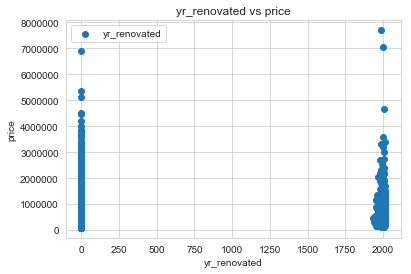

# Final Project Submission

Please fill out:
* Student name: **Savannah McAmis**
* Student pace: **Full time**
* Scheduled project review date/time: **Tue, Jun 4, 2019, 1:30 PM EST**
* Instructor name: **Rafael Carrasco**
* Blog post URL: https://medium.com/@savannahmcamis/project-1-multiple-linear-regression-for-house-sales-in-king-county-wa-3128dab77737

# King County House Sales Analysis
# Data Cleaning and Linear Regression

## Table of Contents

1. [Introduction](#Introduction)
* Data Processing
    * [Import libraries and load data](#Import-libraries-and-load-data)
    * [Gather information about the data](#Gather-information)
    * [Replace placeholders](#Replace-placeholders)
    * [Resolve null values](#Resolve-null-values)
    * [Format data types](#Format-data-types)
* Exploratory Data Analysis
    * [Preliminary EDA](#Preliminary-EDA)
    * [Feature engineering](#Feature-engineeering)
    * [Eliminate extraneous features](#Eliminate-extraneous-features)
    * [Remove outliers](#Remove-outliers)
    * [Transform categorical variables](#Transform-categorical-variables)
    * [Question 1 - What effect does waterfront have on price?](#Question-1)
    * [Question 2 - What effect does location have on price?](#Question-2)
    * [Question 3 - What effect does condition have on price?](#Question-3)
* Linear Regression Modeling
    * [Resolve multicollinearity](#Resolve-multicollinearity)
    * [Scale and normalize variables](#Scale-and-normalize-variables)
    * [Partition dataset for testing](#Partition-dataset)
    * [Create a linear regression model](#Create-a-linear-regression-model)
    * [Validate model](#Validate-model)
* [Analysis](#Analysis)
* [Conclusion](#Conclusion)
* [Future work](#Future-work)

## Introduction

As I began this project, I divided it up into roughly 3 steps: data processing, exploratory data analysis, and linear regression modeling with analysis. 

The processing stage consisted of loading my data and libraries, addressing any placeholders and null values, and formatting the data. I investigated 

Once my data was processed, I began my exploratory data analysis. I engineered new features to better understand the trends in the data. I eliminated extraneous features and removed outliers. I also investigated three different features and their relationship to price: waterfront, location, and condition.

After exploring my data, I began my linear regression modeling. I first resolved any multicollinearity between variables. I scaled and normalized the variables that remained. Then I partitioned my dataset for testing and ran my regression model followed by validation testing. I iterated my model a few times and ended up with a model that I thought best predicted housing prices based on the chosen features. 

[Back to the top](#Final-Project-Submission)

## Import libraries and load data


```python
import pandas as pd
pd.set_option('display.max_columns', None)
import numpy as np

import matplotlib.pyplot as plt
%matplotlib inline  
import seaborn as sns
sns.set_style('whitegrid')

import statsmodels.api as sm
import statsmodels.formula.api as smf
import statsmodels.stats.api as sms
from statsmodels.formula.api import ols
import scipy.stats as stats

from sklearn.linear_model import LinearRegression
from sklearn.metrics import mean_squared_error
from sklearn.model_selection import train_test_split, cross_val_score

import folium
from folium.plugins import MarkerCluster
from folium.plugins import FastMarkerCluster

import os

from math import sqrt

import warnings
warnings.filterwarnings('ignore')
```


```python
df = pd.read_csv('kc_house_data.csv')
```

[Back to the top](#Final-Project-Submission)

## Gather information


```python
df.shape
```


    (21597, 21)


```python
df.describe()
```


<div>
<style scoped>
    .dataframe tbody tr th:only-of-type {
        vertical-align: middle;
    }

    .dataframe tbody tr th {
        vertical-align: top;
    }

    .dataframe thead th {
        text-align: right;
    }
</style>
<table border="1" class="dataframe">
  <thead>
    <tr style="text-align: right;">
      <th></th>
      <th>id</th>
      <th>price</th>
      <th>bedrooms</th>
      <th>bathrooms</th>
      <th>sqft_living</th>
      <th>sqft_lot</th>
      <th>floors</th>
      <th>waterfront</th>
      <th>view</th>
      <th>condition</th>
      <th>grade</th>
      <th>sqft_above</th>
      <th>yr_built</th>
      <th>yr_renovated</th>
      <th>zipcode</th>
      <th>lat</th>
      <th>long</th>
      <th>sqft_living15</th>
      <th>sqft_lot15</th>
    </tr>
  </thead>
  <tbody>
    <tr>
      <th>count</th>
      <td>2.159700e+04</td>
      <td>2.159700e+04</td>
      <td>21597.000000</td>
      <td>21597.000000</td>
      <td>21597.000000</td>
      <td>2.159700e+04</td>
      <td>21597.000000</td>
      <td>19221.000000</td>
      <td>21534.000000</td>
      <td>21597.000000</td>
      <td>21597.000000</td>
      <td>21597.000000</td>
      <td>21597.000000</td>
      <td>17755.000000</td>
      <td>21597.000000</td>
      <td>21597.000000</td>
      <td>21597.000000</td>
      <td>21597.000000</td>
      <td>21597.000000</td>
    </tr>
    <tr>
      <th>mean</th>
      <td>4.580474e+09</td>
      <td>5.402966e+05</td>
      <td>3.373200</td>
      <td>2.115826</td>
      <td>2080.321850</td>
      <td>1.509941e+04</td>
      <td>1.494096</td>
      <td>0.007596</td>
      <td>0.233863</td>
      <td>3.409825</td>
      <td>7.657915</td>
      <td>1788.596842</td>
      <td>1970.999676</td>
      <td>83.636778</td>
      <td>98077.951845</td>
      <td>47.560093</td>
      <td>-122.213982</td>
      <td>1986.620318</td>
      <td>12758.283512</td>
    </tr>
    <tr>
      <th>std</th>
      <td>2.876736e+09</td>
      <td>3.673681e+05</td>
      <td>0.926299</td>
      <td>0.768984</td>
      <td>918.106125</td>
      <td>4.141264e+04</td>
      <td>0.539683</td>
      <td>0.086825</td>
      <td>0.765686</td>
      <td>0.650546</td>
      <td>1.173200</td>
      <td>827.759761</td>
      <td>29.375234</td>
      <td>399.946414</td>
      <td>53.513072</td>
      <td>0.138552</td>
      <td>0.140724</td>
      <td>685.230472</td>
      <td>27274.441950</td>
    </tr>
    <tr>
      <th>min</th>
      <td>1.000102e+06</td>
      <td>7.800000e+04</td>
      <td>1.000000</td>
      <td>0.500000</td>
      <td>370.000000</td>
      <td>5.200000e+02</td>
      <td>1.000000</td>
      <td>0.000000</td>
      <td>0.000000</td>
      <td>1.000000</td>
      <td>3.000000</td>
      <td>370.000000</td>
      <td>1900.000000</td>
      <td>0.000000</td>
      <td>98001.000000</td>
      <td>47.155900</td>
      <td>-122.519000</td>
      <td>399.000000</td>
      <td>651.000000</td>
    </tr>
    <tr>
      <th>25%</th>
      <td>2.123049e+09</td>
      <td>3.220000e+05</td>
      <td>3.000000</td>
      <td>1.750000</td>
      <td>1430.000000</td>
      <td>5.040000e+03</td>
      <td>1.000000</td>
      <td>0.000000</td>
      <td>0.000000</td>
      <td>3.000000</td>
      <td>7.000000</td>
      <td>1190.000000</td>
      <td>1951.000000</td>
      <td>0.000000</td>
      <td>98033.000000</td>
      <td>47.471100</td>
      <td>-122.328000</td>
      <td>1490.000000</td>
      <td>5100.000000</td>
    </tr>
    <tr>
      <th>50%</th>
      <td>3.904930e+09</td>
      <td>4.500000e+05</td>
      <td>3.000000</td>
      <td>2.250000</td>
      <td>1910.000000</td>
      <td>7.618000e+03</td>
      <td>1.500000</td>
      <td>0.000000</td>
      <td>0.000000</td>
      <td>3.000000</td>
      <td>7.000000</td>
      <td>1560.000000</td>
      <td>1975.000000</td>
      <td>0.000000</td>
      <td>98065.000000</td>
      <td>47.571800</td>
      <td>-122.231000</td>
      <td>1840.000000</td>
      <td>7620.000000</td>
    </tr>
    <tr>
      <th>75%</th>
      <td>7.308900e+09</td>
      <td>6.450000e+05</td>
      <td>4.000000</td>
      <td>2.500000</td>
      <td>2550.000000</td>
      <td>1.068500e+04</td>
      <td>2.000000</td>
      <td>0.000000</td>
      <td>0.000000</td>
      <td>4.000000</td>
      <td>8.000000</td>
      <td>2210.000000</td>
      <td>1997.000000</td>
      <td>0.000000</td>
      <td>98118.000000</td>
      <td>47.678000</td>
      <td>-122.125000</td>
      <td>2360.000000</td>
      <td>10083.000000</td>
    </tr>
    <tr>
      <th>max</th>
      <td>9.900000e+09</td>
      <td>7.700000e+06</td>
      <td>33.000000</td>
      <td>8.000000</td>
      <td>13540.000000</td>
      <td>1.651359e+06</td>
      <td>3.500000</td>
      <td>1.000000</td>
      <td>4.000000</td>
      <td>5.000000</td>
      <td>13.000000</td>
      <td>9410.000000</td>
      <td>2015.000000</td>
      <td>2015.000000</td>
      <td>98199.000000</td>
      <td>47.777600</td>
      <td>-121.315000</td>
      <td>6210.000000</td>
      <td>871200.000000</td>
    </tr>
  </tbody>
</table>
</div>


```python
df.info()
```

    <class 'pandas.core.frame.DataFrame'>
    RangeIndex: 21597 entries, 0 to 21596
    Data columns (total 21 columns):
    id               21597 non-null int64
    date             21597 non-null object
    price            21597 non-null float64
    bedrooms         21597 non-null int64
    bathrooms        21597 non-null float64
    sqft_living      21597 non-null int64
    sqft_lot         21597 non-null int64
    floors           21597 non-null float64
    waterfront       19221 non-null float64
    view             21534 non-null float64
    condition        21597 non-null int64
    grade            21597 non-null int64
    sqft_above       21597 non-null int64
    sqft_basement    21597 non-null object
    yr_built         21597 non-null int64
    yr_renovated     17755 non-null float64
    zipcode          21597 non-null int64
    lat              21597 non-null float64
    long             21597 non-null float64
    sqft_living15    21597 non-null int64
    sqft_lot15       21597 non-null int64
    dtypes: float64(8), int64(11), object(2)
    memory usage: 3.5+ MB


```python
df.columns
```


    Index(['id', 'date', 'price', 'bedrooms', 'bathrooms', 'sqft_living',
           'sqft_lot', 'floors', 'waterfront', 'view', 'condition', 'grade',
           'sqft_above', 'sqft_basement', 'yr_built', 'yr_renovated', 'zipcode',
           'lat', 'long', 'sqft_living15', 'sqft_lot15'],
          dtype='object')


```python
df.hist(figsize=(16,12)) ;
```


```python
df.head(20)
```


<div>
<style scoped>
    .dataframe tbody tr th:only-of-type {
        vertical-align: middle;
    }

    .dataframe tbody tr th {
        vertical-align: top;
    }

    .dataframe thead th {
        text-align: right;
    }
</style>
<table border="1" class="dataframe">
  <thead>
    <tr style="text-align: right;">
      <th></th>
      <th>id</th>
      <th>date</th>
      <th>price</th>
      <th>bedrooms</th>
      <th>bathrooms</th>
      <th>sqft_living</th>
      <th>sqft_lot</th>
      <th>floors</th>
      <th>waterfront</th>
      <th>view</th>
      <th>condition</th>
      <th>grade</th>
      <th>sqft_above</th>
      <th>sqft_basement</th>
      <th>yr_built</th>
      <th>yr_renovated</th>
      <th>zipcode</th>
      <th>lat</th>
      <th>long</th>
      <th>sqft_living15</th>
      <th>sqft_lot15</th>
    </tr>
  </thead>
  <tbody>
    <tr>
      <th>0</th>
      <td>7129300520</td>
      <td>10/13/2014</td>
      <td>221900.0</td>
      <td>3</td>
      <td>1.00</td>
      <td>1180</td>
      <td>5650</td>
      <td>1.0</td>
      <td>NaN</td>
      <td>0.0</td>
      <td>3</td>
      <td>7</td>
      <td>1180</td>
      <td>0.0</td>
      <td>1955</td>
      <td>0.0</td>
      <td>98178</td>
      <td>47.5112</td>
      <td>-122.257</td>
      <td>1340</td>
      <td>5650</td>
    </tr>
    <tr>
      <th>1</th>
      <td>6414100192</td>
      <td>12/9/2014</td>
      <td>538000.0</td>
      <td>3</td>
      <td>2.25</td>
      <td>2570</td>
      <td>7242</td>
      <td>2.0</td>
      <td>0.0</td>
      <td>0.0</td>
      <td>3</td>
      <td>7</td>
      <td>2170</td>
      <td>400.0</td>
      <td>1951</td>
      <td>1991.0</td>
      <td>98125</td>
      <td>47.7210</td>
      <td>-122.319</td>
      <td>1690</td>
      <td>7639</td>
    </tr>
    <tr>
      <th>2</th>
      <td>5631500400</td>
      <td>2/25/2015</td>
      <td>180000.0</td>
      <td>2</td>
      <td>1.00</td>
      <td>770</td>
      <td>10000</td>
      <td>1.0</td>
      <td>0.0</td>
      <td>0.0</td>
      <td>3</td>
      <td>6</td>
      <td>770</td>
      <td>0.0</td>
      <td>1933</td>
      <td>NaN</td>
      <td>98028</td>
      <td>47.7379</td>
      <td>-122.233</td>
      <td>2720</td>
      <td>8062</td>
    </tr>
    <tr>
      <th>3</th>
      <td>2487200875</td>
      <td>12/9/2014</td>
      <td>604000.0</td>
      <td>4</td>
      <td>3.00</td>
      <td>1960</td>
      <td>5000</td>
      <td>1.0</td>
      <td>0.0</td>
      <td>0.0</td>
      <td>5</td>
      <td>7</td>
      <td>1050</td>
      <td>910.0</td>
      <td>1965</td>
      <td>0.0</td>
      <td>98136</td>
      <td>47.5208</td>
      <td>-122.393</td>
      <td>1360</td>
      <td>5000</td>
    </tr>
    <tr>
      <th>4</th>
      <td>1954400510</td>
      <td>2/18/2015</td>
      <td>510000.0</td>
      <td>3</td>
      <td>2.00</td>
      <td>1680</td>
      <td>8080</td>
      <td>1.0</td>
      <td>0.0</td>
      <td>0.0</td>
      <td>3</td>
      <td>8</td>
      <td>1680</td>
      <td>0.0</td>
      <td>1987</td>
      <td>0.0</td>
      <td>98074</td>
      <td>47.6168</td>
      <td>-122.045</td>
      <td>1800</td>
      <td>7503</td>
    </tr>
    <tr>
      <th>5</th>
      <td>7237550310</td>
      <td>5/12/2014</td>
      <td>1230000.0</td>
      <td>4</td>
      <td>4.50</td>
      <td>5420</td>
      <td>101930</td>
      <td>1.0</td>
      <td>0.0</td>
      <td>0.0</td>
      <td>3</td>
      <td>11</td>
      <td>3890</td>
      <td>1530.0</td>
      <td>2001</td>
      <td>0.0</td>
      <td>98053</td>
      <td>47.6561</td>
      <td>-122.005</td>
      <td>4760</td>
      <td>101930</td>
    </tr>
    <tr>
      <th>6</th>
      <td>1321400060</td>
      <td>6/27/2014</td>
      <td>257500.0</td>
      <td>3</td>
      <td>2.25</td>
      <td>1715</td>
      <td>6819</td>
      <td>2.0</td>
      <td>0.0</td>
      <td>0.0</td>
      <td>3</td>
      <td>7</td>
      <td>1715</td>
      <td>?</td>
      <td>1995</td>
      <td>0.0</td>
      <td>98003</td>
      <td>47.3097</td>
      <td>-122.327</td>
      <td>2238</td>
      <td>6819</td>
    </tr>
    <tr>
      <th>7</th>
      <td>2008000270</td>
      <td>1/15/2015</td>
      <td>291850.0</td>
      <td>3</td>
      <td>1.50</td>
      <td>1060</td>
      <td>9711</td>
      <td>1.0</td>
      <td>0.0</td>
      <td>NaN</td>
      <td>3</td>
      <td>7</td>
      <td>1060</td>
      <td>0.0</td>
      <td>1963</td>
      <td>0.0</td>
      <td>98198</td>
      <td>47.4095</td>
      <td>-122.315</td>
      <td>1650</td>
      <td>9711</td>
    </tr>
    <tr>
      <th>8</th>
      <td>2414600126</td>
      <td>4/15/2015</td>
      <td>229500.0</td>
      <td>3</td>
      <td>1.00</td>
      <td>1780</td>
      <td>7470</td>
      <td>1.0</td>
      <td>0.0</td>
      <td>0.0</td>
      <td>3</td>
      <td>7</td>
      <td>1050</td>
      <td>730.0</td>
      <td>1960</td>
      <td>0.0</td>
      <td>98146</td>
      <td>47.5123</td>
      <td>-122.337</td>
      <td>1780</td>
      <td>8113</td>
    </tr>
    <tr>
      <th>9</th>
      <td>3793500160</td>
      <td>3/12/2015</td>
      <td>323000.0</td>
      <td>3</td>
      <td>2.50</td>
      <td>1890</td>
      <td>6560</td>
      <td>2.0</td>
      <td>0.0</td>
      <td>0.0</td>
      <td>3</td>
      <td>7</td>
      <td>1890</td>
      <td>0.0</td>
      <td>2003</td>
      <td>0.0</td>
      <td>98038</td>
      <td>47.3684</td>
      <td>-122.031</td>
      <td>2390</td>
      <td>7570</td>
    </tr>
    <tr>
      <th>10</th>
      <td>1736800520</td>
      <td>4/3/2015</td>
      <td>662500.0</td>
      <td>3</td>
      <td>2.50</td>
      <td>3560</td>
      <td>9796</td>
      <td>1.0</td>
      <td>NaN</td>
      <td>0.0</td>
      <td>3</td>
      <td>8</td>
      <td>1860</td>
      <td>1700.0</td>
      <td>1965</td>
      <td>0.0</td>
      <td>98007</td>
      <td>47.6007</td>
      <td>-122.145</td>
      <td>2210</td>
      <td>8925</td>
    </tr>
    <tr>
      <th>11</th>
      <td>9212900260</td>
      <td>5/27/2014</td>
      <td>468000.0</td>
      <td>2</td>
      <td>1.00</td>
      <td>1160</td>
      <td>6000</td>
      <td>1.0</td>
      <td>0.0</td>
      <td>0.0</td>
      <td>4</td>
      <td>7</td>
      <td>860</td>
      <td>300.0</td>
      <td>1942</td>
      <td>0.0</td>
      <td>98115</td>
      <td>47.6900</td>
      <td>-122.292</td>
      <td>1330</td>
      <td>6000</td>
    </tr>
    <tr>
      <th>12</th>
      <td>114101516</td>
      <td>5/28/2014</td>
      <td>310000.0</td>
      <td>3</td>
      <td>1.00</td>
      <td>1430</td>
      <td>19901</td>
      <td>1.5</td>
      <td>0.0</td>
      <td>0.0</td>
      <td>4</td>
      <td>7</td>
      <td>1430</td>
      <td>0.0</td>
      <td>1927</td>
      <td>NaN</td>
      <td>98028</td>
      <td>47.7558</td>
      <td>-122.229</td>
      <td>1780</td>
      <td>12697</td>
    </tr>
    <tr>
      <th>13</th>
      <td>6054650070</td>
      <td>10/7/2014</td>
      <td>400000.0</td>
      <td>3</td>
      <td>1.75</td>
      <td>1370</td>
      <td>9680</td>
      <td>1.0</td>
      <td>0.0</td>
      <td>0.0</td>
      <td>4</td>
      <td>7</td>
      <td>1370</td>
      <td>0.0</td>
      <td>1977</td>
      <td>0.0</td>
      <td>98074</td>
      <td>47.6127</td>
      <td>-122.045</td>
      <td>1370</td>
      <td>10208</td>
    </tr>
    <tr>
      <th>14</th>
      <td>1175000570</td>
      <td>3/12/2015</td>
      <td>530000.0</td>
      <td>5</td>
      <td>2.00</td>
      <td>1810</td>
      <td>4850</td>
      <td>1.5</td>
      <td>0.0</td>
      <td>0.0</td>
      <td>3</td>
      <td>7</td>
      <td>1810</td>
      <td>0.0</td>
      <td>1900</td>
      <td>0.0</td>
      <td>98107</td>
      <td>47.6700</td>
      <td>-122.394</td>
      <td>1360</td>
      <td>4850</td>
    </tr>
    <tr>
      <th>15</th>
      <td>9297300055</td>
      <td>1/24/2015</td>
      <td>650000.0</td>
      <td>4</td>
      <td>3.00</td>
      <td>2950</td>
      <td>5000</td>
      <td>2.0</td>
      <td>0.0</td>
      <td>3.0</td>
      <td>3</td>
      <td>9</td>
      <td>1980</td>
      <td>970.0</td>
      <td>1979</td>
      <td>0.0</td>
      <td>98126</td>
      <td>47.5714</td>
      <td>-122.375</td>
      <td>2140</td>
      <td>4000</td>
    </tr>
    <tr>
      <th>16</th>
      <td>1875500060</td>
      <td>7/31/2014</td>
      <td>395000.0</td>
      <td>3</td>
      <td>2.00</td>
      <td>1890</td>
      <td>14040</td>
      <td>2.0</td>
      <td>0.0</td>
      <td>0.0</td>
      <td>3</td>
      <td>7</td>
      <td>1890</td>
      <td>0.0</td>
      <td>1994</td>
      <td>0.0</td>
      <td>98019</td>
      <td>47.7277</td>
      <td>-121.962</td>
      <td>1890</td>
      <td>14018</td>
    </tr>
    <tr>
      <th>17</th>
      <td>6865200140</td>
      <td>5/29/2014</td>
      <td>485000.0</td>
      <td>4</td>
      <td>1.00</td>
      <td>1600</td>
      <td>4300</td>
      <td>1.5</td>
      <td>0.0</td>
      <td>0.0</td>
      <td>4</td>
      <td>7</td>
      <td>1600</td>
      <td>0.0</td>
      <td>1916</td>
      <td>0.0</td>
      <td>98103</td>
      <td>47.6648</td>
      <td>-122.343</td>
      <td>1610</td>
      <td>4300</td>
    </tr>
    <tr>
      <th>18</th>
      <td>16000397</td>
      <td>12/5/2014</td>
      <td>189000.0</td>
      <td>2</td>
      <td>1.00</td>
      <td>1200</td>
      <td>9850</td>
      <td>1.0</td>
      <td>0.0</td>
      <td>0.0</td>
      <td>4</td>
      <td>7</td>
      <td>1200</td>
      <td>?</td>
      <td>1921</td>
      <td>0.0</td>
      <td>98002</td>
      <td>47.3089</td>
      <td>-122.210</td>
      <td>1060</td>
      <td>5095</td>
    </tr>
    <tr>
      <th>19</th>
      <td>7983200060</td>
      <td>4/24/2015</td>
      <td>230000.0</td>
      <td>3</td>
      <td>1.00</td>
      <td>1250</td>
      <td>9774</td>
      <td>1.0</td>
      <td>0.0</td>
      <td>0.0</td>
      <td>4</td>
      <td>7</td>
      <td>1250</td>
      <td>0.0</td>
      <td>1969</td>
      <td>0.0</td>
      <td>98003</td>
      <td>47.3343</td>
      <td>-122.306</td>
      <td>1280</td>
      <td>8850</td>
    </tr>
  </tbody>
</table>
</div>


```python
df.isna().any()
```


    id               False
    date             False
    price            False
    bedrooms         False
    bathrooms        False
    sqft_living      False
    sqft_lot         False
    floors           False
    waterfront        True
    view              True
    condition        False
    grade            False
    sqft_above       False
    sqft_basement    False
    yr_built         False
    yr_renovated      True
    zipcode          False
    lat              False
    long             False
    sqft_living15    False
    sqft_lot15       False
    dtype: bool


Let's look at a preliminary regression model


```python
y = df['price']
# Take out price, objects, and columns with null values
x = df.drop(['price', 'date', 'sqft_basement', 'waterfront', 'yr_renovated', 'view'], axis=1)
#X = sm.add_constant(x)
linreg = sm.OLS(y, x).fit()
linreg.summary()
```


<table class="simpletable">
<caption>OLS Regression Results</caption>
<tr>
  <th>Dep. Variable:</th>          <td>price</td>      <th>  R-squared:         </th>  <td>   0.661</td>  
</tr>
<tr>
  <th>Model:</th>                   <td>OLS</td>       <th>  Adj. R-squared:    </th>  <td>   0.661</td>  
</tr>
<tr>
  <th>Method:</th>             <td>Least Squares</td>  <th>  F-statistic:       </th>  <td>   3003.</td>  
</tr>
<tr>
  <th>Date:</th>             <td>Mon, 03 Jun 2019</td> <th>  Prob (F-statistic):</th>   <td>  0.00</td>   
</tr>
<tr>
  <th>Time:</th>                 <td>22:57:49</td>     <th>  Log-Likelihood:    </th> <td>-2.9572e+05</td>
</tr>
<tr>
  <th>No. Observations:</th>      <td> 21597</td>      <th>  AIC:               </th>  <td>5.915e+05</td> 
</tr>
<tr>
  <th>Df Residuals:</th>          <td> 21582</td>      <th>  BIC:               </th>  <td>5.916e+05</td> 
</tr>
<tr>
  <th>Df Model:</th>              <td>    14</td>      <th>                     </th>      <td> </td>     
</tr>
<tr>
  <th>Covariance Type:</th>      <td>nonrobust</td>    <th>                     </th>      <td> </td>     
</tr>
</table>
<table class="simpletable">
<tr>
        <td></td>           <th>coef</th>     <th>std err</th>      <th>t</th>      <th>P>|t|</th>  <th>[0.025</th>    <th>0.975]</th>  
</tr>
<tr>
  <th>id</th>            <td>-9.659e-07</td> <td> 5.13e-07</td> <td>   -1.883</td> <td> 0.060</td> <td>-1.97e-06</td> <td> 3.93e-08</td>
</tr>
<tr>
  <th>bedrooms</th>      <td>-4.683e+04</td> <td> 2003.587</td> <td>  -23.374</td> <td> 0.000</td> <td>-5.08e+04</td> <td>-4.29e+04</td>
</tr>
<tr>
  <th>bathrooms</th>     <td> 4.735e+04</td> <td> 3443.479</td> <td>   13.750</td> <td> 0.000</td> <td> 4.06e+04</td> <td> 5.41e+04</td>
</tr>
<tr>
  <th>sqft_living</th>   <td>  180.2720</td> <td>    4.582</td> <td>   39.347</td> <td> 0.000</td> <td>  171.292</td> <td>  189.252</td>
</tr>
<tr>
  <th>sqft_lot</th>      <td>    0.1450</td> <td>    0.051</td> <td>    2.845</td> <td> 0.004</td> <td>    0.045</td> <td>    0.245</td>
</tr>
<tr>
  <th>floors</th>        <td> 1.348e+04</td> <td> 3764.645</td> <td>    3.581</td> <td> 0.000</td> <td> 6101.521</td> <td> 2.09e+04</td>
</tr>
<tr>
  <th>condition</th>     <td>  2.53e+04</td> <td> 2439.664</td> <td>   10.372</td> <td> 0.000</td> <td> 2.05e+04</td> <td> 3.01e+04</td>
</tr>
<tr>
  <th>grade</th>         <td> 1.034e+05</td> <td> 2279.305</td> <td>   45.361</td> <td> 0.000</td> <td> 9.89e+04</td> <td> 1.08e+05</td>
</tr>
<tr>
  <th>sqft_above</th>    <td>    6.4953</td> <td>    4.514</td> <td>    1.439</td> <td> 0.150</td> <td>   -2.352</td> <td>   15.343</td>
</tr>
<tr>
  <th>yr_built</th>      <td>-3096.6095</td> <td>   67.880</td> <td>  -45.619</td> <td> 0.000</td> <td>-3229.660</td> <td>-2963.559</td>
</tr>
<tr>
  <th>zipcode</th>       <td> -518.5378</td> <td>   18.971</td> <td>  -27.333</td> <td> 0.000</td> <td> -555.723</td> <td> -481.353</td>
</tr>
<tr>
  <th>lat</th>           <td> 5.504e+05</td> <td> 1.13e+04</td> <td>   48.493</td> <td> 0.000</td> <td> 5.28e+05</td> <td> 5.73e+05</td>
</tr>
<tr>
  <th>long</th>          <td>-2.457e+05</td> <td> 1.39e+04</td> <td>  -17.664</td> <td> 0.000</td> <td>-2.73e+05</td> <td>-2.18e+05</td>
</tr>
<tr>
  <th>sqft_living15</th> <td>   37.5591</td> <td>    3.570</td> <td>   10.520</td> <td> 0.000</td> <td>   30.561</td> <td>   44.557</td>
</tr>
<tr>
  <th>sqft_lot15</th>    <td>   -0.3379</td> <td>    0.078</td> <td>   -4.326</td> <td> 0.000</td> <td>   -0.491</td> <td>   -0.185</td>
</tr>
</table>
<table class="simpletable">
<tr>
  <th>Omnibus:</th>       <td>19489.941</td> <th>  Durbin-Watson:     </th>  <td>   1.993</td>  
</tr>
<tr>
  <th>Prob(Omnibus):</th>  <td> 0.000</td>   <th>  Jarque-Bera (JB):  </th> <td>1942760.660</td>
</tr>
<tr>
  <th>Skew:</th>           <td> 3.955</td>   <th>  Prob(JB):          </th>  <td>    0.00</td>  
</tr>
<tr>
  <th>Kurtosis:</th>       <td>48.786</td>   <th>  Cond. No.          </th>  <td>5.20e+10</td>  
</tr>
</table><br/><br/>Warnings:<br/>[1] Standard Errors assume that the covariance matrix of the errors is correctly specified.<br/>[2] The condition number is large, 5.2e+10. This might indicate that there are<br/>strong multicollinearity or other numerical problems.


**Observations:**
* R squared value .661
* Skew 3.955
* Kurtosis 48.786
* Fairly low p values except for sqft_above and id
* Need to clean up the data first

[Back to the top](#Final-Project-Submission)

## Replace placeholders

While examining the data, I noticed '?'s in the column sqft_basement. I will replace the '?'s with null values. I will replace the null values in the following step.


```python
df.isna().sum()
```


    id                  0
    date                0
    price               0
    bedrooms            0
    bathrooms           0
    sqft_living         0
    sqft_lot            0
    floors              0
    waterfront       2376
    view               63
    condition           0
    grade               0
    sqft_above          0
    sqft_basement       0
    yr_built            0
    yr_renovated     3842
    zipcode             0
    lat                 0
    long                0
    sqft_living15       0
    sqft_lot15          0
    dtype: int64


```python
df.sqft_basement.unique()
```


    array(['0.0', '400.0', '910.0', '1530.0', '?', '730.0', '1700.0', '300.0',
           '970.0', '760.0', '720.0', '700.0', '820.0', '780.0', '790.0',
           '330.0', '1620.0', '360.0', '588.0', '1510.0', '410.0', '990.0',
           '600.0', '560.0', '550.0', '1000.0', '1600.0', '500.0', '1040.0',
           '880.0', '1010.0', '240.0', '265.0', '290.0', '800.0', '540.0',
           '710.0', '840.0', '380.0', '770.0', '480.0', '570.0', '1490.0',
           '620.0', '1250.0', '1270.0', '120.0', '650.0', '180.0', '1130.0',
           '450.0', '1640.0', '1460.0', '1020.0', '1030.0', '750.0', '640.0',
           '1070.0', '490.0', '1310.0', '630.0', '2000.0', '390.0', '430.0',
           '850.0', '210.0', '1430.0', '1950.0', '440.0', '220.0', '1160.0',
           '860.0', '580.0', '2060.0', '1820.0', '1180.0', '200.0', '1150.0',
           '1200.0', '680.0', '530.0', '1450.0', '1170.0', '1080.0', '960.0',
           '280.0', '870.0', '1100.0', '460.0', '1400.0', '660.0', '1220.0',
           '900.0', '420.0', '1580.0', '1380.0', '475.0', '690.0', '270.0',
           '350.0', '935.0', '1370.0', '980.0', '1470.0', '160.0', '950.0',
           '50.0', '740.0', '1780.0', '1900.0', '340.0', '470.0', '370.0',
           '140.0', '1760.0', '130.0', '520.0', '890.0', '1110.0', '150.0',
           '1720.0', '810.0', '190.0', '1290.0', '670.0', '1800.0', '1120.0',
           '1810.0', '60.0', '1050.0', '940.0', '310.0', '930.0', '1390.0',
           '610.0', '1830.0', '1300.0', '510.0', '1330.0', '1590.0', '920.0',
           '1320.0', '1420.0', '1240.0', '1960.0', '1560.0', '2020.0',
           '1190.0', '2110.0', '1280.0', '250.0', '2390.0', '1230.0', '170.0',
           '830.0', '1260.0', '1410.0', '1340.0', '590.0', '1500.0', '1140.0',
           '260.0', '100.0', '320.0', '1480.0', '1060.0', '1284.0', '1670.0',
           '1350.0', '2570.0', '1090.0', '110.0', '2500.0', '90.0', '1940.0',
           '1550.0', '2350.0', '2490.0', '1481.0', '1360.0', '1135.0',
           '1520.0', '1850.0', '1660.0', '2130.0', '2600.0', '1690.0',
           '243.0', '1210.0', '1024.0', '1798.0', '1610.0', '1440.0',
           '1570.0', '1650.0', '704.0', '1910.0', '1630.0', '2360.0',
           '1852.0', '2090.0', '2400.0', '1790.0', '2150.0', '230.0', '70.0',
           '1680.0', '2100.0', '3000.0', '1870.0', '1710.0', '2030.0',
           '875.0', '1540.0', '2850.0', '2170.0', '506.0', '906.0', '145.0',
           '2040.0', '784.0', '1750.0', '374.0', '518.0', '2720.0', '2730.0',
           '1840.0', '3480.0', '2160.0', '1920.0', '2330.0', '1860.0',
           '2050.0', '4820.0', '1913.0', '80.0', '2010.0', '3260.0', '2200.0',
           '415.0', '1730.0', '652.0', '2196.0', '1930.0', '515.0', '40.0',
           '2080.0', '2580.0', '1548.0', '1740.0', '235.0', '861.0', '1890.0',
           '2220.0', '792.0', '2070.0', '4130.0', '2250.0', '2240.0',
           '1990.0', '768.0', '2550.0', '435.0', '1008.0', '2300.0', '2610.0',
           '666.0', '3500.0', '172.0', '1816.0', '2190.0', '1245.0', '1525.0',
           '1880.0', '862.0', '946.0', '1281.0', '414.0', '2180.0', '276.0',
           '1248.0', '602.0', '516.0', '176.0', '225.0', '1275.0', '266.0',
           '283.0', '65.0', '2310.0', '10.0', '1770.0', '2120.0', '295.0',
           '207.0', '915.0', '556.0', '417.0', '143.0', '508.0', '2810.0',
           '20.0', '274.0', '248.0'], dtype=object)


```python
# Replace placeholders with null values
df.sqft_basement.replace(to_replace='?', value=np.nan, inplace=True)
```


```python
df.isna().sum()
```


    id                  0
    date                0
    price               0
    bedrooms            0
    bathrooms           0
    sqft_living         0
    sqft_lot            0
    floors              0
    waterfront       2376
    view               63
    condition           0
    grade               0
    sqft_above          0
    sqft_basement     454
    yr_built            0
    yr_renovated     3842
    zipcode             0
    lat                 0
    long                0
    sqft_living15       0
    sqft_lot15          0
    dtype: int64


Excellent. Now those 454 placeholders in sqft_basement have been converted to null values. 

[Back to the top](#Final-Project-Submission)

## Resolve null values

The next step is to eliminate our null values. There are several ways to do this. Let's look through the columns with null values. 


```python
# Count of rows with null values
sum([True for idx,row in df.iterrows() if any(row.isnull())])
```


    6168


```python
# Percentage of rows with null values
6168/21597
```


    0.28559522155854977


### Waterfront

Let's examine **waterfront** more closely. 
* Waterfront is a binary variable containing 0s and 1s. I could convert this to a boolean or leave it as a float. Either way, I think it will function the same so I will leave it. 
* I could assume that a null value means no waterfront and replace all nulls with 0. The null values consist of 11% of my data so replacing them with 0s could also skew my data. 
* I could drop all of the rows with null values in waterfront but in doing so I could inadvertently drop important information. 
* The dominant value is 0 so replacing the nulls with 0 would not have a huge effect. Null in a boolean variable defaults to False anyway.
* I could also split waterfront into two columns and look at just the null values.


```python
df.shape
```


    (21597, 21)


```python
# Number of nulls
df.waterfront.isna().sum()
```


    2376


```python
# Percentage of null values in waterfront:
pnw = 2376/21597 * 100
pnw
```


    11.00152798999861


I'm going to create two dataframes: one containing the rows without null values for waterfront and the other containing the rows with null values for waterfront. Then I can use them to look closer at the data.


```python
# Make new dataframe with nulls for waterfront removed
df_w = df[(df.waterfront==df.waterfront)]
df_w.shape
```


    (19221, 21)


```python
# Check
df_w.waterfront.value_counts()
```


    0.0    19075
    1.0      146
    Name: waterfront, dtype: int64


```python
# Map all properties with nulls for waterfront removed
m_w = folium.Map([df_w['lat'].mean(), df_w['long'].mean()], zoom_start=11)
for index, row in df_w.iterrows():
    folium.CircleMarker([row['lat'], row['long']],
                        radius=3,
                        fill_color="#FF0000",
                        fill=True# divvy color
                       ).add_to(m_w)
m_w.save('map_w.html')
```


```python
# Make new dataframe of just nulls from waterfront
df_nw = df[(df.waterfront != df.waterfront)]
df_nw.shape
```


    (2376, 21)


```python
# Map all properties will null values for waterfront
m_nw = folium.Map([df_nw['lat'].mean(), df_nw['long'].mean()], zoom_start=11)
for index, row in df_nw.iterrows():
    folium.CircleMarker([row['lat'], row['long']],
                        radius=3,
                        fill_color="#FF0000",
                        fill=True# divvy color
                       ).add_to(m_nw)
m_nw.save('map_nw.html')
```


```python
# Make new dataframe of just waterfront properties
df_water = df[df['waterfront'] == 1]
df_water.shape
```


    (146, 21)


```python
# Map all the waterfront properties
m_water = folium.Map([df_water['lat'].mean(), df_water['long'].mean()], zoom_start=11)
for index, row in df_water.iterrows():
    folium.CircleMarker([row['lat'], row['long']],
                        radius=3,
                        fill_color="#FF0000",
                        fill=True# divvy color
                       ).add_to(m_water)
m_water.save('map_water.html')
```

> Open maps in new windows. Crashes jupyter notebook.

Now I can see the properties with null values for waterfront on a map. Overall, they seem to be distributed similarly to our full dataset. The vast majority of properties are not waterfront, but there are still a handful that seem to be on the water. 

### Waterfront

From my analysis above, I am going to **delete the rows containing null values for waterfront**. I think this is an important feature, and I do not want to skew my data.


```python
# Delete rows containing null values for waterfront
df = df.dropna(subset=['waterfront'])
```


```python
# Check
df.waterfront.isna().sum()
```


    0


### View
Let's examine **view** more closely. 

* View refers to how many times a property has been viewed. It contains values 0, 1, 2, 3, and 4. 
* I could assume a null value in view means it has not been viewed. 
* I could drop all of the rows with null values in view. 
* There are only 63 rows with null values for view.


```python
df.view.unique()
```


    array([ 0., nan,  3.,  4.,  2.,  1.])


```python
df.view.value_counts()
```


    0.0    17312
    2.0      836
    3.0      435
    1.0      291
    4.0      290
    Name: view, dtype: int64


```python
df.view.isna().sum()
```


    57


There are so few rows with null values in view. I'm just going to **delete those rows**. 


```python
# Delete rows containing null values for view
df = df.dropna(subset=['view'])
```


```python
# Check
df.view.isna().sum()
```


    0


### Sqft_basement
Let's take a closer look at **sqft_basement**.

* This column refers to the size of the basement. 
* I could drop these rows. 
* I could replace them with the mean basement size.
* I could assume they mean no basement and replace them with 0s. 


```python
df.sqft_basement.isna().sum()
```


    415


```python
# Make new dataframe with nulls for sqft_basement removed
df_b = df[df['sqft_basement'] == df['sqft_basement']]
```


```python
df_b.sqft_basement.isna().sum()
```


    0


```python
plt.scatter(df_b['sqft_basement'], df_b['price'], label='sqft_basement')
plt.title('sqft_basement vs price')
plt.legend()
plt.xlabel('sqft_basement')
plt.ylabel('price')
plt.show()
```


Sqft_basement does not seem to have much relationship to the price of a house. For that reason, I am going to **replace the null values with 0**. I am not worried about skewing my data because I probably won't use it anyway.


```python
# Replace null values with 0
df.sqft_basement.replace(to_replace=np.nan, value=0.0, inplace=True)
```


```python
# Check
df.sqft_basement.isna().sum()
```


    0


### Yr_renovated
Let's take a closer look at **yr_renovated**.

* This is the year that the house was renovated.
* I could drop the rows but then I would lose a lot of data. 
* I could assume null value means the house has not been renovated. 
* I don't think it would be appropriate to put another value in these cells.
* I am going to replace null values with 0s because I don't think it will negatively impact my data too much. 


```python
df.yr_renovated.isna().sum()
```


    3402


```python
plt.scatter(df['yr_renovated'], df['price'], label='yr_renovated')
plt.title('yr_renovated vs price')
plt.legend()
plt.xlabel('yr_renovated')
plt.ylabel('price')
plt.show()
```





```python
df.yr_renovated.value_counts()
```


    0.0       15111
    2014.0       64
    2013.0       29
    2005.0       27
    2000.0       25
    2007.0       24
    2003.0       24
    1990.0       22
    2009.0       19
    2006.0       18
    2004.0       18
    1989.0       17
    2002.0       15
    1998.0       15
    2008.0       15
    1984.0       14
    2010.0       14
    2001.0       14
    1987.0       13
    1999.0       13
    1994.0       13
    1991.0       13
    2015.0       13
    1997.0       12
    1992.0       12
    1983.0       11
    1986.0       11
    1985.0       11
    1993.0       11
    1988.0       10
              ...  
    1975.0        5
    1968.0        5
    1969.0        4
    1973.0        4
    1960.0        3
    1978.0        3
    1958.0        3
    1965.0        3
    1972.0        3
    1956.0        3
    1981.0        3
    1963.0        3
    1945.0        2
    1940.0        2
    1957.0        2
    1955.0        2
    1946.0        1
    1951.0        1
    1944.0        1
    1976.0        1
    1934.0        1
    1974.0        1
    1962.0        1
    1967.0        1
    1948.0        1
    1953.0        1
    1950.0        1
    1954.0        1
    1959.0        1
    1971.0        1
    Name: yr_renovated, Length: 70, dtype: int64


Yr_renovated does not seem to have much relationship to the price of a house. For that reason, I am going to **replace the null values with 0**. I am not worried about skewing my data because I probably won't use it anyway.


```python
# Replace null values in yr_renovated with 0
df.yr_renovated.replace(to_replace=np.nan, value=0.0, inplace=True)
```


```python
#Check
df.isna().sum()
```


    id               0
    date             0
    price            0
    bedrooms         0
    bathrooms        0
    sqft_living      0
    sqft_lot         0
    floors           0
    waterfront       0
    view             0
    condition        0
    grade            0
    sqft_above       0
    sqft_basement    0
    yr_built         0
    yr_renovated     0
    zipcode          0
    lat              0
    long             0
    sqft_living15    0
    sqft_lot15       0
    dtype: int64


```python
df.isna().any().any()
```


    False


[Back to the top](#Final-Project-Submission)

## Format data types


```python
df.info()
```

    <class 'pandas.core.frame.DataFrame'>
    Int64Index: 19164 entries, 1 to 21596
    Data columns (total 21 columns):
    id               19164 non-null int64
    date             19164 non-null object
    price            19164 non-null float64
    bedrooms         19164 non-null int64
    bathrooms        19164 non-null float64
    sqft_living      19164 non-null int64
    sqft_lot         19164 non-null int64
    floors           19164 non-null float64
    waterfront       19164 non-null float64
    view             19164 non-null float64
    condition        19164 non-null int64
    grade            19164 non-null int64
    sqft_above       19164 non-null int64
    sqft_basement    19164 non-null object
    yr_built         19164 non-null int64
    yr_renovated     19164 non-null float64
    zipcode          19164 non-null int64
    lat              19164 non-null float64
    long             19164 non-null float64
    sqft_living15    19164 non-null int64
    sqft_lot15       19164 non-null int64
    dtypes: float64(8), int64(11), object(2)
    memory usage: 3.2+ MB


The next step is to format the data types. All of the columns are either int or float except for date and sqft_basement. Date should be type datetime so we can use it for modeling later. Column sqft_basement should be int for consistency with the other sqft variables. Also column waterfront should be boolean.


```python
pd.to_datetime(df['date'], format='%m/%d/%Y').head()
```


    1   2014-12-09
    2   2015-02-25
    3   2014-12-09
    4   2015-02-18
    5   2014-05-12
    Name: date, dtype: datetime64[ns]


```python
df['date'] = pd.to_datetime(df['date'], format='%m/%d/%Y')
```


```python
df['sqft_basement'] = df['sqft_basement'].astype('float64').astype('int64')
```


```python
#df['waterfront'] = df['waterfront'].astype('bool')
```


```python
df.info()
```

    <class 'pandas.core.frame.DataFrame'>
    Int64Index: 19164 entries, 1 to 21596
    Data columns (total 21 columns):
    id               19164 non-null int64
    date             19164 non-null datetime64[ns]
    price            19164 non-null float64
    bedrooms         19164 non-null int64
    bathrooms        19164 non-null float64
    sqft_living      19164 non-null int64
    sqft_lot         19164 non-null int64
    floors           19164 non-null float64
    waterfront       19164 non-null float64
    view             19164 non-null float64
    condition        19164 non-null int64
    grade            19164 non-null int64
    sqft_above       19164 non-null int64
    sqft_basement    19164 non-null int64
    yr_built         19164 non-null int64
    yr_renovated     19164 non-null float64
    zipcode          19164 non-null int64
    lat              19164 non-null float64
    long             19164 non-null float64
    sqft_living15    19164 non-null int64
    sqft_lot15       19164 non-null int64
    dtypes: datetime64[ns](1), float64(8), int64(12)
    memory usage: 3.2 MB


[Back to the top](#Final-Project-Submission)

## Exploratory Data Analysis

## Preliminary EDA

Let's look through the variables in our dataset. 
* **Continuous variables** - 'price', 'sqft_above', 'sqft_basement', 'sqft_living', 'sqft_lot', 'sqft_living15', 'sqft_lot15', 'lat', 'long'
* **Discrete variables** - 'bedrooms', 'bathrooms', 'floors', 'yr_built', 'yr_renovated', 'view'
* **Categorical variables** - 'condition', 'grade', 'zipcode'
* **Boolean variables** - 'waterfront'
* **Unimportant variables** - 'id'

The continuous variables will need to be scaled and normalized. The discrete variables can all be treated as continuous variables. The categorical variables will need to be binned and one-hot encoded before modeling. The binary variables will be ignored for now. Finally, the unimportant variables will be removed. 


```python
abs(df.corr() > .7)
```


<div>
<style scoped>
    .dataframe tbody tr th:only-of-type {
        vertical-align: middle;
    }

    .dataframe tbody tr th {
        vertical-align: top;
    }

    .dataframe thead th {
        text-align: right;
    }
</style>
<table border="1" class="dataframe">
  <thead>
    <tr style="text-align: right;">
      <th></th>
      <th>id</th>
      <th>price</th>
      <th>bedrooms</th>
      <th>bathrooms</th>
      <th>sqft_living</th>
      <th>sqft_lot</th>
      <th>floors</th>
      <th>waterfront</th>
      <th>view</th>
      <th>condition</th>
      <th>grade</th>
      <th>sqft_above</th>
      <th>sqft_basement</th>
      <th>yr_built</th>
      <th>yr_renovated</th>
      <th>zipcode</th>
      <th>lat</th>
      <th>long</th>
      <th>sqft_living15</th>
      <th>sqft_lot15</th>
    </tr>
  </thead>
  <tbody>
    <tr>
      <th>id</th>
      <td>True</td>
      <td>False</td>
      <td>False</td>
      <td>False</td>
      <td>False</td>
      <td>False</td>
      <td>False</td>
      <td>False</td>
      <td>False</td>
      <td>False</td>
      <td>False</td>
      <td>False</td>
      <td>False</td>
      <td>False</td>
      <td>False</td>
      <td>False</td>
      <td>False</td>
      <td>False</td>
      <td>False</td>
      <td>False</td>
    </tr>
    <tr>
      <th>price</th>
      <td>False</td>
      <td>True</td>
      <td>False</td>
      <td>False</td>
      <td>True</td>
      <td>False</td>
      <td>False</td>
      <td>False</td>
      <td>False</td>
      <td>False</td>
      <td>False</td>
      <td>False</td>
      <td>False</td>
      <td>False</td>
      <td>False</td>
      <td>False</td>
      <td>False</td>
      <td>False</td>
      <td>False</td>
      <td>False</td>
    </tr>
    <tr>
      <th>bedrooms</th>
      <td>False</td>
      <td>False</td>
      <td>True</td>
      <td>False</td>
      <td>False</td>
      <td>False</td>
      <td>False</td>
      <td>False</td>
      <td>False</td>
      <td>False</td>
      <td>False</td>
      <td>False</td>
      <td>False</td>
      <td>False</td>
      <td>False</td>
      <td>False</td>
      <td>False</td>
      <td>False</td>
      <td>False</td>
      <td>False</td>
    </tr>
    <tr>
      <th>bathrooms</th>
      <td>False</td>
      <td>False</td>
      <td>False</td>
      <td>True</td>
      <td>True</td>
      <td>False</td>
      <td>False</td>
      <td>False</td>
      <td>False</td>
      <td>False</td>
      <td>False</td>
      <td>False</td>
      <td>False</td>
      <td>False</td>
      <td>False</td>
      <td>False</td>
      <td>False</td>
      <td>False</td>
      <td>False</td>
      <td>False</td>
    </tr>
    <tr>
      <th>sqft_living</th>
      <td>False</td>
      <td>True</td>
      <td>False</td>
      <td>True</td>
      <td>True</td>
      <td>False</td>
      <td>False</td>
      <td>False</td>
      <td>False</td>
      <td>False</td>
      <td>True</td>
      <td>True</td>
      <td>False</td>
      <td>False</td>
      <td>False</td>
      <td>False</td>
      <td>False</td>
      <td>False</td>
      <td>True</td>
      <td>False</td>
    </tr>
    <tr>
      <th>sqft_lot</th>
      <td>False</td>
      <td>False</td>
      <td>False</td>
      <td>False</td>
      <td>False</td>
      <td>True</td>
      <td>False</td>
      <td>False</td>
      <td>False</td>
      <td>False</td>
      <td>False</td>
      <td>False</td>
      <td>False</td>
      <td>False</td>
      <td>False</td>
      <td>False</td>
      <td>False</td>
      <td>False</td>
      <td>False</td>
      <td>True</td>
    </tr>
    <tr>
      <th>floors</th>
      <td>False</td>
      <td>False</td>
      <td>False</td>
      <td>False</td>
      <td>False</td>
      <td>False</td>
      <td>True</td>
      <td>False</td>
      <td>False</td>
      <td>False</td>
      <td>False</td>
      <td>False</td>
      <td>False</td>
      <td>False</td>
      <td>False</td>
      <td>False</td>
      <td>False</td>
      <td>False</td>
      <td>False</td>
      <td>False</td>
    </tr>
    <tr>
      <th>waterfront</th>
      <td>False</td>
      <td>False</td>
      <td>False</td>
      <td>False</td>
      <td>False</td>
      <td>False</td>
      <td>False</td>
      <td>True</td>
      <td>False</td>
      <td>False</td>
      <td>False</td>
      <td>False</td>
      <td>False</td>
      <td>False</td>
      <td>False</td>
      <td>False</td>
      <td>False</td>
      <td>False</td>
      <td>False</td>
      <td>False</td>
    </tr>
    <tr>
      <th>view</th>
      <td>False</td>
      <td>False</td>
      <td>False</td>
      <td>False</td>
      <td>False</td>
      <td>False</td>
      <td>False</td>
      <td>False</td>
      <td>True</td>
      <td>False</td>
      <td>False</td>
      <td>False</td>
      <td>False</td>
      <td>False</td>
      <td>False</td>
      <td>False</td>
      <td>False</td>
      <td>False</td>
      <td>False</td>
      <td>False</td>
    </tr>
    <tr>
      <th>condition</th>
      <td>False</td>
      <td>False</td>
      <td>False</td>
      <td>False</td>
      <td>False</td>
      <td>False</td>
      <td>False</td>
      <td>False</td>
      <td>False</td>
      <td>True</td>
      <td>False</td>
      <td>False</td>
      <td>False</td>
      <td>False</td>
      <td>False</td>
      <td>False</td>
      <td>False</td>
      <td>False</td>
      <td>False</td>
      <td>False</td>
    </tr>
    <tr>
      <th>grade</th>
      <td>False</td>
      <td>False</td>
      <td>False</td>
      <td>False</td>
      <td>True</td>
      <td>False</td>
      <td>False</td>
      <td>False</td>
      <td>False</td>
      <td>False</td>
      <td>True</td>
      <td>True</td>
      <td>False</td>
      <td>False</td>
      <td>False</td>
      <td>False</td>
      <td>False</td>
      <td>False</td>
      <td>True</td>
      <td>False</td>
    </tr>
    <tr>
      <th>sqft_above</th>
      <td>False</td>
      <td>False</td>
      <td>False</td>
      <td>False</td>
      <td>True</td>
      <td>False</td>
      <td>False</td>
      <td>False</td>
      <td>False</td>
      <td>False</td>
      <td>True</td>
      <td>True</td>
      <td>False</td>
      <td>False</td>
      <td>False</td>
      <td>False</td>
      <td>False</td>
      <td>False</td>
      <td>True</td>
      <td>False</td>
    </tr>
    <tr>
      <th>sqft_basement</th>
      <td>False</td>
      <td>False</td>
      <td>False</td>
      <td>False</td>
      <td>False</td>
      <td>False</td>
      <td>False</td>
      <td>False</td>
      <td>False</td>
      <td>False</td>
      <td>False</td>
      <td>False</td>
      <td>True</td>
      <td>False</td>
      <td>False</td>
      <td>False</td>
      <td>False</td>
      <td>False</td>
      <td>False</td>
      <td>False</td>
    </tr>
    <tr>
      <th>yr_built</th>
      <td>False</td>
      <td>False</td>
      <td>False</td>
      <td>False</td>
      <td>False</td>
      <td>False</td>
      <td>False</td>
      <td>False</td>
      <td>False</td>
      <td>False</td>
      <td>False</td>
      <td>False</td>
      <td>False</td>
      <td>True</td>
      <td>False</td>
      <td>False</td>
      <td>False</td>
      <td>False</td>
      <td>False</td>
      <td>False</td>
    </tr>
    <tr>
      <th>yr_renovated</th>
      <td>False</td>
      <td>False</td>
      <td>False</td>
      <td>False</td>
      <td>False</td>
      <td>False</td>
      <td>False</td>
      <td>False</td>
      <td>False</td>
      <td>False</td>
      <td>False</td>
      <td>False</td>
      <td>False</td>
      <td>False</td>
      <td>True</td>
      <td>False</td>
      <td>False</td>
      <td>False</td>
      <td>False</td>
      <td>False</td>
    </tr>
    <tr>
      <th>zipcode</th>
      <td>False</td>
      <td>False</td>
      <td>False</td>
      <td>False</td>
      <td>False</td>
      <td>False</td>
      <td>False</td>
      <td>False</td>
      <td>False</td>
      <td>False</td>
      <td>False</td>
      <td>False</td>
      <td>False</td>
      <td>False</td>
      <td>False</td>
      <td>True</td>
      <td>False</td>
      <td>False</td>
      <td>False</td>
      <td>False</td>
    </tr>
    <tr>
      <th>lat</th>
      <td>False</td>
      <td>False</td>
      <td>False</td>
      <td>False</td>
      <td>False</td>
      <td>False</td>
      <td>False</td>
      <td>False</td>
      <td>False</td>
      <td>False</td>
      <td>False</td>
      <td>False</td>
      <td>False</td>
      <td>False</td>
      <td>False</td>
      <td>False</td>
      <td>True</td>
      <td>False</td>
      <td>False</td>
      <td>False</td>
    </tr>
    <tr>
      <th>long</th>
      <td>False</td>
      <td>False</td>
      <td>False</td>
      <td>False</td>
      <td>False</td>
      <td>False</td>
      <td>False</td>
      <td>False</td>
      <td>False</td>
      <td>False</td>
      <td>False</td>
      <td>False</td>
      <td>False</td>
      <td>False</td>
      <td>False</td>
      <td>False</td>
      <td>False</td>
      <td>True</td>
      <td>False</td>
      <td>False</td>
    </tr>
    <tr>
      <th>sqft_living15</th>
      <td>False</td>
      <td>False</td>
      <td>False</td>
      <td>False</td>
      <td>True</td>
      <td>False</td>
      <td>False</td>
      <td>False</td>
      <td>False</td>
      <td>False</td>
      <td>True</td>
      <td>True</td>
      <td>False</td>
      <td>False</td>
      <td>False</td>
      <td>False</td>
      <td>False</td>
      <td>False</td>
      <td>True</td>
      <td>False</td>
    </tr>
    <tr>
      <th>sqft_lot15</th>
      <td>False</td>
      <td>False</td>
      <td>False</td>
      <td>False</td>
      <td>False</td>
      <td>True</td>
      <td>False</td>
      <td>False</td>
      <td>False</td>
      <td>False</td>
      <td>False</td>
      <td>False</td>
      <td>False</td>
      <td>False</td>
      <td>False</td>
      <td>False</td>
      <td>False</td>
      <td>False</td>
      <td>False</td>
      <td>True</td>
    </tr>
  </tbody>
</table>
</div>


[Back to the top](#Final-Project-Submission)

## Feature engineering

Let's create some new columns to describe our data.
* total_sqft_inside = sqft_above + sqft_basement
* total_sqft = sqft_living + sqft_lot
* last_updated = greater of (yr_built, yr_renovated)
* year_sold = df['date'].dt.year
* age_when_sold = yr_sold - yr_built
* age_since_renovated = yr_sold - last_updated


```python
# Create yr_sold column
df['yr_sold'] = df['date'].dt.year
df.head()
```


<div>
<style scoped>
    .dataframe tbody tr th:only-of-type {
        vertical-align: middle;
    }

    .dataframe tbody tr th {
        vertical-align: top;
    }

    .dataframe thead th {
        text-align: right;
    }
</style>
<table border="1" class="dataframe">
  <thead>
    <tr style="text-align: right;">
      <th></th>
      <th>id</th>
      <th>date</th>
      <th>price</th>
      <th>bedrooms</th>
      <th>bathrooms</th>
      <th>sqft_living</th>
      <th>sqft_lot</th>
      <th>floors</th>
      <th>waterfront</th>
      <th>view</th>
      <th>condition</th>
      <th>grade</th>
      <th>sqft_above</th>
      <th>sqft_basement</th>
      <th>yr_built</th>
      <th>yr_renovated</th>
      <th>zipcode</th>
      <th>lat</th>
      <th>long</th>
      <th>sqft_living15</th>
      <th>sqft_lot15</th>
      <th>yr_sold</th>
    </tr>
  </thead>
  <tbody>
    <tr>
      <th>1</th>
      <td>6414100192</td>
      <td>2014-12-09</td>
      <td>538000.0</td>
      <td>3</td>
      <td>2.25</td>
      <td>2570</td>
      <td>7242</td>
      <td>2.0</td>
      <td>0.0</td>
      <td>0.0</td>
      <td>3</td>
      <td>7</td>
      <td>2170</td>
      <td>400</td>
      <td>1951</td>
      <td>1991.0</td>
      <td>98125</td>
      <td>47.7210</td>
      <td>-122.319</td>
      <td>1690</td>
      <td>7639</td>
      <td>2014</td>
    </tr>
    <tr>
      <th>2</th>
      <td>5631500400</td>
      <td>2015-02-25</td>
      <td>180000.0</td>
      <td>2</td>
      <td>1.00</td>
      <td>770</td>
      <td>10000</td>
      <td>1.0</td>
      <td>0.0</td>
      <td>0.0</td>
      <td>3</td>
      <td>6</td>
      <td>770</td>
      <td>0</td>
      <td>1933</td>
      <td>0.0</td>
      <td>98028</td>
      <td>47.7379</td>
      <td>-122.233</td>
      <td>2720</td>
      <td>8062</td>
      <td>2015</td>
    </tr>
    <tr>
      <th>3</th>
      <td>2487200875</td>
      <td>2014-12-09</td>
      <td>604000.0</td>
      <td>4</td>
      <td>3.00</td>
      <td>1960</td>
      <td>5000</td>
      <td>1.0</td>
      <td>0.0</td>
      <td>0.0</td>
      <td>5</td>
      <td>7</td>
      <td>1050</td>
      <td>910</td>
      <td>1965</td>
      <td>0.0</td>
      <td>98136</td>
      <td>47.5208</td>
      <td>-122.393</td>
      <td>1360</td>
      <td>5000</td>
      <td>2014</td>
    </tr>
    <tr>
      <th>4</th>
      <td>1954400510</td>
      <td>2015-02-18</td>
      <td>510000.0</td>
      <td>3</td>
      <td>2.00</td>
      <td>1680</td>
      <td>8080</td>
      <td>1.0</td>
      <td>0.0</td>
      <td>0.0</td>
      <td>3</td>
      <td>8</td>
      <td>1680</td>
      <td>0</td>
      <td>1987</td>
      <td>0.0</td>
      <td>98074</td>
      <td>47.6168</td>
      <td>-122.045</td>
      <td>1800</td>
      <td>7503</td>
      <td>2015</td>
    </tr>
    <tr>
      <th>5</th>
      <td>7237550310</td>
      <td>2014-05-12</td>
      <td>1230000.0</td>
      <td>4</td>
      <td>4.50</td>
      <td>5420</td>
      <td>101930</td>
      <td>1.0</td>
      <td>0.0</td>
      <td>0.0</td>
      <td>3</td>
      <td>11</td>
      <td>3890</td>
      <td>1530</td>
      <td>2001</td>
      <td>0.0</td>
      <td>98053</td>
      <td>47.6561</td>
      <td>-122.005</td>
      <td>4760</td>
      <td>101930</td>
      <td>2014</td>
    </tr>
  </tbody>
</table>
</div>


```python
# Create age_when_sold column
df['age_when_sold'] = df['yr_sold'] - df['yr_built']
df.age_when_sold.unique()
```


    array([ 63,  82,  49,  28,  13,  19,  55,  12,  72,  87,  37, 115,  36,
            20,  98,  93,  46,  67,  29,  73,  99, 105,  66,  10,  11,   9,
            85,  33,  84,  81, 110,  18,  30,   0,  92,  62,  59,  64,  34,
            88,   6,  24,  60,  35,  89,  41,  43,  50,  58,  74,  22,  51,
            53,   8,  26,  14,  75,  68,  48,  39, 104,  31, 114,   4,  69,
            90,  27, 101,  25,  54, 109,   7,  47,  52,  15,  38,  16,  61,
           113,  21,  94,  45, 100, 111,  96,  97,  86, 103,  78,  77, 107,
            40,  57, 102,  17,  71,   1,  23,  91,  42,  65,  95,  32,   3,
            56,  44, 112,   5,  70,   2,  80,  76,  83, 106, 108,  79,  -1])


```python
# Create total_sqft_inside column
df['total_sqft_inside'] = df['sqft_above'] + df['sqft_basement']
df.head()
```


<div>
<style scoped>
    .dataframe tbody tr th:only-of-type {
        vertical-align: middle;
    }

    .dataframe tbody tr th {
        vertical-align: top;
    }

    .dataframe thead th {
        text-align: right;
    }
</style>
<table border="1" class="dataframe">
  <thead>
    <tr style="text-align: right;">
      <th></th>
      <th>id</th>
      <th>date</th>
      <th>price</th>
      <th>bedrooms</th>
      <th>bathrooms</th>
      <th>sqft_living</th>
      <th>sqft_lot</th>
      <th>floors</th>
      <th>waterfront</th>
      <th>view</th>
      <th>condition</th>
      <th>grade</th>
      <th>sqft_above</th>
      <th>sqft_basement</th>
      <th>yr_built</th>
      <th>yr_renovated</th>
      <th>zipcode</th>
      <th>lat</th>
      <th>long</th>
      <th>sqft_living15</th>
      <th>sqft_lot15</th>
      <th>yr_sold</th>
      <th>age_when_sold</th>
      <th>total_sqft_inside</th>
    </tr>
  </thead>
  <tbody>
    <tr>
      <th>1</th>
      <td>6414100192</td>
      <td>2014-12-09</td>
      <td>538000.0</td>
      <td>3</td>
      <td>2.25</td>
      <td>2570</td>
      <td>7242</td>
      <td>2.0</td>
      <td>0.0</td>
      <td>0.0</td>
      <td>3</td>
      <td>7</td>
      <td>2170</td>
      <td>400</td>
      <td>1951</td>
      <td>1991.0</td>
      <td>98125</td>
      <td>47.7210</td>
      <td>-122.319</td>
      <td>1690</td>
      <td>7639</td>
      <td>2014</td>
      <td>63</td>
      <td>2570</td>
    </tr>
    <tr>
      <th>2</th>
      <td>5631500400</td>
      <td>2015-02-25</td>
      <td>180000.0</td>
      <td>2</td>
      <td>1.00</td>
      <td>770</td>
      <td>10000</td>
      <td>1.0</td>
      <td>0.0</td>
      <td>0.0</td>
      <td>3</td>
      <td>6</td>
      <td>770</td>
      <td>0</td>
      <td>1933</td>
      <td>0.0</td>
      <td>98028</td>
      <td>47.7379</td>
      <td>-122.233</td>
      <td>2720</td>
      <td>8062</td>
      <td>2015</td>
      <td>82</td>
      <td>770</td>
    </tr>
    <tr>
      <th>3</th>
      <td>2487200875</td>
      <td>2014-12-09</td>
      <td>604000.0</td>
      <td>4</td>
      <td>3.00</td>
      <td>1960</td>
      <td>5000</td>
      <td>1.0</td>
      <td>0.0</td>
      <td>0.0</td>
      <td>5</td>
      <td>7</td>
      <td>1050</td>
      <td>910</td>
      <td>1965</td>
      <td>0.0</td>
      <td>98136</td>
      <td>47.5208</td>
      <td>-122.393</td>
      <td>1360</td>
      <td>5000</td>
      <td>2014</td>
      <td>49</td>
      <td>1960</td>
    </tr>
    <tr>
      <th>4</th>
      <td>1954400510</td>
      <td>2015-02-18</td>
      <td>510000.0</td>
      <td>3</td>
      <td>2.00</td>
      <td>1680</td>
      <td>8080</td>
      <td>1.0</td>
      <td>0.0</td>
      <td>0.0</td>
      <td>3</td>
      <td>8</td>
      <td>1680</td>
      <td>0</td>
      <td>1987</td>
      <td>0.0</td>
      <td>98074</td>
      <td>47.6168</td>
      <td>-122.045</td>
      <td>1800</td>
      <td>7503</td>
      <td>2015</td>
      <td>28</td>
      <td>1680</td>
    </tr>
    <tr>
      <th>5</th>
      <td>7237550310</td>
      <td>2014-05-12</td>
      <td>1230000.0</td>
      <td>4</td>
      <td>4.50</td>
      <td>5420</td>
      <td>101930</td>
      <td>1.0</td>
      <td>0.0</td>
      <td>0.0</td>
      <td>3</td>
      <td>11</td>
      <td>3890</td>
      <td>1530</td>
      <td>2001</td>
      <td>0.0</td>
      <td>98053</td>
      <td>47.6561</td>
      <td>-122.005</td>
      <td>4760</td>
      <td>101930</td>
      <td>2014</td>
      <td>13</td>
      <td>5420</td>
    </tr>
  </tbody>
</table>
</div>


```python
# Create total_sqft column
df['total_sqft'] = df['sqft_living'] + df['sqft_lot']
df.head()
```


<div>
<style scoped>
    .dataframe tbody tr th:only-of-type {
        vertical-align: middle;
    }

    .dataframe tbody tr th {
        vertical-align: top;
    }

    .dataframe thead th {
        text-align: right;
    }
</style>
<table border="1" class="dataframe">
  <thead>
    <tr style="text-align: right;">
      <th></th>
      <th>id</th>
      <th>date</th>
      <th>price</th>
      <th>bedrooms</th>
      <th>bathrooms</th>
      <th>sqft_living</th>
      <th>sqft_lot</th>
      <th>floors</th>
      <th>waterfront</th>
      <th>view</th>
      <th>condition</th>
      <th>grade</th>
      <th>sqft_above</th>
      <th>sqft_basement</th>
      <th>yr_built</th>
      <th>yr_renovated</th>
      <th>zipcode</th>
      <th>lat</th>
      <th>long</th>
      <th>sqft_living15</th>
      <th>sqft_lot15</th>
      <th>yr_sold</th>
      <th>age_when_sold</th>
      <th>total_sqft_inside</th>
      <th>total_sqft</th>
    </tr>
  </thead>
  <tbody>
    <tr>
      <th>1</th>
      <td>6414100192</td>
      <td>2014-12-09</td>
      <td>538000.0</td>
      <td>3</td>
      <td>2.25</td>
      <td>2570</td>
      <td>7242</td>
      <td>2.0</td>
      <td>0.0</td>
      <td>0.0</td>
      <td>3</td>
      <td>7</td>
      <td>2170</td>
      <td>400</td>
      <td>1951</td>
      <td>1991.0</td>
      <td>98125</td>
      <td>47.7210</td>
      <td>-122.319</td>
      <td>1690</td>
      <td>7639</td>
      <td>2014</td>
      <td>63</td>
      <td>2570</td>
      <td>9812</td>
    </tr>
    <tr>
      <th>2</th>
      <td>5631500400</td>
      <td>2015-02-25</td>
      <td>180000.0</td>
      <td>2</td>
      <td>1.00</td>
      <td>770</td>
      <td>10000</td>
      <td>1.0</td>
      <td>0.0</td>
      <td>0.0</td>
      <td>3</td>
      <td>6</td>
      <td>770</td>
      <td>0</td>
      <td>1933</td>
      <td>0.0</td>
      <td>98028</td>
      <td>47.7379</td>
      <td>-122.233</td>
      <td>2720</td>
      <td>8062</td>
      <td>2015</td>
      <td>82</td>
      <td>770</td>
      <td>10770</td>
    </tr>
    <tr>
      <th>3</th>
      <td>2487200875</td>
      <td>2014-12-09</td>
      <td>604000.0</td>
      <td>4</td>
      <td>3.00</td>
      <td>1960</td>
      <td>5000</td>
      <td>1.0</td>
      <td>0.0</td>
      <td>0.0</td>
      <td>5</td>
      <td>7</td>
      <td>1050</td>
      <td>910</td>
      <td>1965</td>
      <td>0.0</td>
      <td>98136</td>
      <td>47.5208</td>
      <td>-122.393</td>
      <td>1360</td>
      <td>5000</td>
      <td>2014</td>
      <td>49</td>
      <td>1960</td>
      <td>6960</td>
    </tr>
    <tr>
      <th>4</th>
      <td>1954400510</td>
      <td>2015-02-18</td>
      <td>510000.0</td>
      <td>3</td>
      <td>2.00</td>
      <td>1680</td>
      <td>8080</td>
      <td>1.0</td>
      <td>0.0</td>
      <td>0.0</td>
      <td>3</td>
      <td>8</td>
      <td>1680</td>
      <td>0</td>
      <td>1987</td>
      <td>0.0</td>
      <td>98074</td>
      <td>47.6168</td>
      <td>-122.045</td>
      <td>1800</td>
      <td>7503</td>
      <td>2015</td>
      <td>28</td>
      <td>1680</td>
      <td>9760</td>
    </tr>
    <tr>
      <th>5</th>
      <td>7237550310</td>
      <td>2014-05-12</td>
      <td>1230000.0</td>
      <td>4</td>
      <td>4.50</td>
      <td>5420</td>
      <td>101930</td>
      <td>1.0</td>
      <td>0.0</td>
      <td>0.0</td>
      <td>3</td>
      <td>11</td>
      <td>3890</td>
      <td>1530</td>
      <td>2001</td>
      <td>0.0</td>
      <td>98053</td>
      <td>47.6561</td>
      <td>-122.005</td>
      <td>4760</td>
      <td>101930</td>
      <td>2014</td>
      <td>13</td>
      <td>5420</td>
      <td>107350</td>
    </tr>
  </tbody>
</table>
</div>


```python
# Create last_updated column
df['last_updated'] = np.nan
df.loc[df['yr_renovated'] > df['yr_built'], 'last_updated'] = df['yr_renovated']
df.loc[df['yr_renovated'] <= df['yr_built'], 'last_updated'] = df['yr_built']  
df.head()
```


<div>
<style scoped>
    .dataframe tbody tr th:only-of-type {
        vertical-align: middle;
    }

    .dataframe tbody tr th {
        vertical-align: top;
    }

    .dataframe thead th {
        text-align: right;
    }
</style>
<table border="1" class="dataframe">
  <thead>
    <tr style="text-align: right;">
      <th></th>
      <th>id</th>
      <th>date</th>
      <th>price</th>
      <th>bedrooms</th>
      <th>bathrooms</th>
      <th>sqft_living</th>
      <th>sqft_lot</th>
      <th>floors</th>
      <th>waterfront</th>
      <th>view</th>
      <th>condition</th>
      <th>grade</th>
      <th>sqft_above</th>
      <th>sqft_basement</th>
      <th>yr_built</th>
      <th>yr_renovated</th>
      <th>zipcode</th>
      <th>lat</th>
      <th>long</th>
      <th>sqft_living15</th>
      <th>sqft_lot15</th>
      <th>yr_sold</th>
      <th>age_when_sold</th>
      <th>total_sqft_inside</th>
      <th>total_sqft</th>
      <th>last_updated</th>
    </tr>
  </thead>
  <tbody>
    <tr>
      <th>1</th>
      <td>6414100192</td>
      <td>2014-12-09</td>
      <td>538000.0</td>
      <td>3</td>
      <td>2.25</td>
      <td>2570</td>
      <td>7242</td>
      <td>2.0</td>
      <td>0.0</td>
      <td>0.0</td>
      <td>3</td>
      <td>7</td>
      <td>2170</td>
      <td>400</td>
      <td>1951</td>
      <td>1991.0</td>
      <td>98125</td>
      <td>47.7210</td>
      <td>-122.319</td>
      <td>1690</td>
      <td>7639</td>
      <td>2014</td>
      <td>63</td>
      <td>2570</td>
      <td>9812</td>
      <td>1991.0</td>
    </tr>
    <tr>
      <th>2</th>
      <td>5631500400</td>
      <td>2015-02-25</td>
      <td>180000.0</td>
      <td>2</td>
      <td>1.00</td>
      <td>770</td>
      <td>10000</td>
      <td>1.0</td>
      <td>0.0</td>
      <td>0.0</td>
      <td>3</td>
      <td>6</td>
      <td>770</td>
      <td>0</td>
      <td>1933</td>
      <td>0.0</td>
      <td>98028</td>
      <td>47.7379</td>
      <td>-122.233</td>
      <td>2720</td>
      <td>8062</td>
      <td>2015</td>
      <td>82</td>
      <td>770</td>
      <td>10770</td>
      <td>1933.0</td>
    </tr>
    <tr>
      <th>3</th>
      <td>2487200875</td>
      <td>2014-12-09</td>
      <td>604000.0</td>
      <td>4</td>
      <td>3.00</td>
      <td>1960</td>
      <td>5000</td>
      <td>1.0</td>
      <td>0.0</td>
      <td>0.0</td>
      <td>5</td>
      <td>7</td>
      <td>1050</td>
      <td>910</td>
      <td>1965</td>
      <td>0.0</td>
      <td>98136</td>
      <td>47.5208</td>
      <td>-122.393</td>
      <td>1360</td>
      <td>5000</td>
      <td>2014</td>
      <td>49</td>
      <td>1960</td>
      <td>6960</td>
      <td>1965.0</td>
    </tr>
    <tr>
      <th>4</th>
      <td>1954400510</td>
      <td>2015-02-18</td>
      <td>510000.0</td>
      <td>3</td>
      <td>2.00</td>
      <td>1680</td>
      <td>8080</td>
      <td>1.0</td>
      <td>0.0</td>
      <td>0.0</td>
      <td>3</td>
      <td>8</td>
      <td>1680</td>
      <td>0</td>
      <td>1987</td>
      <td>0.0</td>
      <td>98074</td>
      <td>47.6168</td>
      <td>-122.045</td>
      <td>1800</td>
      <td>7503</td>
      <td>2015</td>
      <td>28</td>
      <td>1680</td>
      <td>9760</td>
      <td>1987.0</td>
    </tr>
    <tr>
      <th>5</th>
      <td>7237550310</td>
      <td>2014-05-12</td>
      <td>1230000.0</td>
      <td>4</td>
      <td>4.50</td>
      <td>5420</td>
      <td>101930</td>
      <td>1.0</td>
      <td>0.0</td>
      <td>0.0</td>
      <td>3</td>
      <td>11</td>
      <td>3890</td>
      <td>1530</td>
      <td>2001</td>
      <td>0.0</td>
      <td>98053</td>
      <td>47.6561</td>
      <td>-122.005</td>
      <td>4760</td>
      <td>101930</td>
      <td>2014</td>
      <td>13</td>
      <td>5420</td>
      <td>107350</td>
      <td>2001.0</td>
    </tr>
  </tbody>
</table>
</div>


```python
# Create age_since_updated column
df['age_since_updated'] = df['yr_sold'] - df['last_updated']
df['age_since_updated'].values[df['age_since_updated'].values <= 0] = 0.1
```


```python
df['age_since_updated'].unique()
```


    array([2.30e+01, 8.20e+01, 4.90e+01, 2.80e+01, 1.30e+01, 1.90e+01,
           5.50e+01, 1.20e+01, 7.20e+01, 8.70e+01, 3.70e+01, 1.15e+02,
           3.60e+01, 2.00e+01, 9.80e+01, 9.30e+01, 4.60e+01, 6.70e+01,
           2.90e+01, 7.30e+01, 9.90e+01, 1.05e+02, 6.60e+01, 1.00e+01,
           1.10e+01, 9.00e+00, 8.50e+01, 3.30e+01, 8.10e+01, 1.10e+02,
           1.80e+01, 3.00e+01, 1.00e-01, 9.20e+01, 6.20e+01, 5.90e+01,
           6.40e+01, 3.40e+01, 8.80e+01, 6.00e+00, 2.40e+01, 6.00e+01,
           3.50e+01, 8.90e+01, 4.10e+01, 4.30e+01, 5.00e+01, 5.80e+01,
           7.40e+01, 2.20e+01, 5.10e+01, 5.30e+01, 8.00e+00, 2.60e+01,
           1.40e+01, 7.50e+01, 4.80e+01, 3.90e+01, 1.04e+02, 3.10e+01,
           4.00e+00, 1.14e+02, 6.90e+01, 9.00e+01, 2.70e+01, 2.50e+01,
           5.40e+01, 1.09e+02, 7.00e+00, 6.80e+01, 4.70e+01, 1.00e+00,
           5.20e+01, 1.50e+01, 3.80e+01, 1.60e+01, 6.10e+01, 1.13e+02,
           2.10e+01, 9.40e+01, 4.50e+01, 1.00e+02, 9.60e+01, 9.70e+01,
           8.60e+01, 1.03e+02, 7.80e+01, 7.70e+01, 1.07e+02, 8.40e+01,
           4.00e+01, 5.70e+01, 1.02e+02, 1.70e+01, 7.10e+01, 6.30e+01,
           9.10e+01, 4.20e+01, 6.50e+01, 3.00e+00, 9.50e+01, 3.20e+01,
           5.60e+01, 4.40e+01, 1.12e+02, 5.00e+00, 7.00e+01, 2.00e+00,
           8.00e+01, 7.60e+01, 1.01e+02, 8.30e+01, 1.06e+02, 1.08e+02,
           1.11e+02, 7.90e+01])


```python
df.head()
```


<div>
<style scoped>
    .dataframe tbody tr th:only-of-type {
        vertical-align: middle;
    }

    .dataframe tbody tr th {
        vertical-align: top;
    }

    .dataframe thead th {
        text-align: right;
    }
</style>
<table border="1" class="dataframe">
  <thead>
    <tr style="text-align: right;">
      <th></th>
      <th>id</th>
      <th>date</th>
      <th>price</th>
      <th>bedrooms</th>
      <th>bathrooms</th>
      <th>sqft_living</th>
      <th>sqft_lot</th>
      <th>floors</th>
      <th>waterfront</th>
      <th>view</th>
      <th>condition</th>
      <th>grade</th>
      <th>sqft_above</th>
      <th>sqft_basement</th>
      <th>yr_built</th>
      <th>yr_renovated</th>
      <th>zipcode</th>
      <th>lat</th>
      <th>long</th>
      <th>sqft_living15</th>
      <th>sqft_lot15</th>
      <th>yr_sold</th>
      <th>age_when_sold</th>
      <th>total_sqft_inside</th>
      <th>total_sqft</th>
      <th>last_updated</th>
      <th>age_since_updated</th>
    </tr>
  </thead>
  <tbody>
    <tr>
      <th>1</th>
      <td>6414100192</td>
      <td>2014-12-09</td>
      <td>538000.0</td>
      <td>3</td>
      <td>2.25</td>
      <td>2570</td>
      <td>7242</td>
      <td>2.0</td>
      <td>0.0</td>
      <td>0.0</td>
      <td>3</td>
      <td>7</td>
      <td>2170</td>
      <td>400</td>
      <td>1951</td>
      <td>1991.0</td>
      <td>98125</td>
      <td>47.7210</td>
      <td>-122.319</td>
      <td>1690</td>
      <td>7639</td>
      <td>2014</td>
      <td>63</td>
      <td>2570</td>
      <td>9812</td>
      <td>1991.0</td>
      <td>23.0</td>
    </tr>
    <tr>
      <th>2</th>
      <td>5631500400</td>
      <td>2015-02-25</td>
      <td>180000.0</td>
      <td>2</td>
      <td>1.00</td>
      <td>770</td>
      <td>10000</td>
      <td>1.0</td>
      <td>0.0</td>
      <td>0.0</td>
      <td>3</td>
      <td>6</td>
      <td>770</td>
      <td>0</td>
      <td>1933</td>
      <td>0.0</td>
      <td>98028</td>
      <td>47.7379</td>
      <td>-122.233</td>
      <td>2720</td>
      <td>8062</td>
      <td>2015</td>
      <td>82</td>
      <td>770</td>
      <td>10770</td>
      <td>1933.0</td>
      <td>82.0</td>
    </tr>
    <tr>
      <th>3</th>
      <td>2487200875</td>
      <td>2014-12-09</td>
      <td>604000.0</td>
      <td>4</td>
      <td>3.00</td>
      <td>1960</td>
      <td>5000</td>
      <td>1.0</td>
      <td>0.0</td>
      <td>0.0</td>
      <td>5</td>
      <td>7</td>
      <td>1050</td>
      <td>910</td>
      <td>1965</td>
      <td>0.0</td>
      <td>98136</td>
      <td>47.5208</td>
      <td>-122.393</td>
      <td>1360</td>
      <td>5000</td>
      <td>2014</td>
      <td>49</td>
      <td>1960</td>
      <td>6960</td>
      <td>1965.0</td>
      <td>49.0</td>
    </tr>
    <tr>
      <th>4</th>
      <td>1954400510</td>
      <td>2015-02-18</td>
      <td>510000.0</td>
      <td>3</td>
      <td>2.00</td>
      <td>1680</td>
      <td>8080</td>
      <td>1.0</td>
      <td>0.0</td>
      <td>0.0</td>
      <td>3</td>
      <td>8</td>
      <td>1680</td>
      <td>0</td>
      <td>1987</td>
      <td>0.0</td>
      <td>98074</td>
      <td>47.6168</td>
      <td>-122.045</td>
      <td>1800</td>
      <td>7503</td>
      <td>2015</td>
      <td>28</td>
      <td>1680</td>
      <td>9760</td>
      <td>1987.0</td>
      <td>28.0</td>
    </tr>
    <tr>
      <th>5</th>
      <td>7237550310</td>
      <td>2014-05-12</td>
      <td>1230000.0</td>
      <td>4</td>
      <td>4.50</td>
      <td>5420</td>
      <td>101930</td>
      <td>1.0</td>
      <td>0.0</td>
      <td>0.0</td>
      <td>3</td>
      <td>11</td>
      <td>3890</td>
      <td>1530</td>
      <td>2001</td>
      <td>0.0</td>
      <td>98053</td>
      <td>47.6561</td>
      <td>-122.005</td>
      <td>4760</td>
      <td>101930</td>
      <td>2014</td>
      <td>13</td>
      <td>5420</td>
      <td>107350</td>
      <td>2001.0</td>
      <td>13.0</td>
    </tr>
  </tbody>
</table>
</div>


```python
df.columns
```


    Index(['id', 'date', 'price', 'bedrooms', 'bathrooms', 'sqft_living',
           'sqft_lot', 'floors', 'waterfront', 'view', 'condition', 'grade',
           'sqft_above', 'sqft_basement', 'yr_built', 'yr_renovated', 'zipcode',
           'lat', 'long', 'sqft_living15', 'sqft_lot15', 'yr_sold',
           'age_when_sold', 'total_sqft_inside', 'total_sqft', 'last_updated',
           'age_since_updated'],
          dtype='object')


[Back to the top](#Final-Project-Submission)

## Eliminate extraneous features

Let's eliminate some of the columns that we definitely won't use in the regression model.


```python
# Check linearity assumption with scatter plots
data = ['bedrooms', 'bathrooms', 'sqft_living',
       'sqft_lot', 'floors', 'waterfront', 'view', 'condition', 'grade',
       'sqft_above', 'sqft_basement', 'yr_built', 'yr_renovated', 'zipcode',
       'lat', 'long', 'sqft_living15', 'sqft_lot15', 'yr_sold',
       'age_when_sold', 'total_sqft_inside', 'total_sqft', 'last_updated',
       'age_since_updated']

for column in data:
    plt.scatter(df[column], df.price, label=column)
    plt.legend()
    plt.show()
```


From these scatter plots, I can determine which columns have linear relationships with price and eliminate the others. 

I will delete sqft_lot, floors, view, sqft_basement, yr_built, yr_renovated, zipcode, sqft_lot15, yr_sold, age_when_sold, total_sqft, and last_updated.

I will keep bedrooms, bathrooms, sqft_living, waterfront, condition, grade, sqft_above, lat, long, sqft_living15, total_sqft_inside, and age_since_updated.


```python
df.columns
```


    Index(['id', 'date', 'price', 'bedrooms', 'bathrooms', 'sqft_living',
           'sqft_lot', 'floors', 'waterfront', 'view', 'condition', 'grade',
           'sqft_above', 'sqft_basement', 'yr_built', 'yr_renovated', 'zipcode',
           'lat', 'long', 'sqft_living15', 'sqft_lot15', 'yr_sold',
           'age_when_sold', 'total_sqft_inside', 'total_sqft', 'last_updated',
           'age_since_updated'],
          dtype='object')


```python
df2 = df.drop(['id', 'date', 'yr_built', 'yr_renovated', 'yr_sold',
               'last_updated'], axis=1)
df2.columns
```


    Index(['price', 'bedrooms', 'bathrooms', 'sqft_living', 'sqft_lot', 'floors',
           'waterfront', 'view', 'condition', 'grade', 'sqft_above',
           'sqft_basement', 'zipcode', 'lat', 'long', 'sqft_living15',
           'sqft_lot15', 'age_when_sold', 'total_sqft_inside', 'total_sqft',
           'age_since_updated'],
          dtype='object')


```python
# This takes a really long time and sometimes crashes
pd.plotting.scatter_matrix(df2,figsize  = [9, 9], diagonal='hist', alpha=0.6);
```


```python
df2.describe()
```


<div>
<style scoped>
    .dataframe tbody tr th:only-of-type {
        vertical-align: middle;
    }

    .dataframe tbody tr th {
        vertical-align: top;
    }

    .dataframe thead th {
        text-align: right;
    }
</style>
<table border="1" class="dataframe">
  <thead>
    <tr style="text-align: right;">
      <th></th>
      <th>price</th>
      <th>bedrooms</th>
      <th>bathrooms</th>
      <th>sqft_living</th>
      <th>sqft_lot</th>
      <th>floors</th>
      <th>waterfront</th>
      <th>view</th>
      <th>condition</th>
      <th>grade</th>
      <th>sqft_above</th>
      <th>sqft_basement</th>
      <th>zipcode</th>
      <th>lat</th>
      <th>long</th>
      <th>sqft_living15</th>
      <th>sqft_lot15</th>
      <th>age_when_sold</th>
      <th>total_sqft_inside</th>
      <th>total_sqft</th>
      <th>age_since_updated</th>
    </tr>
  </thead>
  <tbody>
    <tr>
      <th>count</th>
      <td>1.916400e+04</td>
      <td>19164.000000</td>
      <td>19164.000000</td>
      <td>19164.000000</td>
      <td>1.916400e+04</td>
      <td>19164.000000</td>
      <td>19164.000000</td>
      <td>19164.000000</td>
      <td>19164.000000</td>
      <td>19164.000000</td>
      <td>19164.000000</td>
      <td>19164.000000</td>
      <td>19164.000000</td>
      <td>19164.000000</td>
      <td>19164.000000</td>
      <td>19164.000000</td>
      <td>19164.000000</td>
      <td>19164.000000</td>
      <td>19164.000000</td>
      <td>1.916400e+04</td>
      <td>19164.000000</td>
    </tr>
    <tr>
      <th>mean</th>
      <td>5.414490e+05</td>
      <td>3.374452</td>
      <td>2.117029</td>
      <td>2082.038301</td>
      <td>1.506174e+04</td>
      <td>1.495173</td>
      <td>0.007566</td>
      <td>0.231058</td>
      <td>3.409987</td>
      <td>7.660718</td>
      <td>1791.425433</td>
      <td>284.380662</td>
      <td>98077.726466</td>
      <td>47.560018</td>
      <td>-122.214011</td>
      <td>1987.221874</td>
      <td>12797.653882</td>
      <td>43.282091</td>
      <td>2075.806095</td>
      <td>1.714378e+04</td>
      <td>41.363677</td>
    </tr>
    <tr>
      <th>std</th>
      <td>3.709009e+05</td>
      <td>0.928676</td>
      <td>0.769241</td>
      <td>921.918226</td>
      <td>4.077215e+04</td>
      <td>0.540308</td>
      <td>0.086657</td>
      <td>0.763368</td>
      <td>0.650456</td>
      <td>1.175601</td>
      <td>831.776073</td>
      <td>439.443059</td>
      <td>53.448716</td>
      <td>0.138661</td>
      <td>0.140728</td>
      <td>684.787028</td>
      <td>27552.634083</td>
      <td>29.389697</td>
      <td>921.149889</td>
      <td>4.094228e+04</td>
      <td>28.972579</td>
    </tr>
    <tr>
      <th>min</th>
      <td>7.800000e+04</td>
      <td>1.000000</td>
      <td>0.500000</td>
      <td>370.000000</td>
      <td>5.200000e+02</td>
      <td>1.000000</td>
      <td>0.000000</td>
      <td>0.000000</td>
      <td>1.000000</td>
      <td>3.000000</td>
      <td>370.000000</td>
      <td>0.000000</td>
      <td>98001.000000</td>
      <td>47.155900</td>
      <td>-122.519000</td>
      <td>399.000000</td>
      <td>651.000000</td>
      <td>-1.000000</td>
      <td>370.000000</td>
      <td>1.452000e+03</td>
      <td>0.100000</td>
    </tr>
    <tr>
      <th>25%</th>
      <td>3.220000e+05</td>
      <td>3.000000</td>
      <td>1.750000</td>
      <td>1430.000000</td>
      <td>5.040000e+03</td>
      <td>1.000000</td>
      <td>0.000000</td>
      <td>0.000000</td>
      <td>3.000000</td>
      <td>7.000000</td>
      <td>1200.000000</td>
      <td>0.000000</td>
      <td>98033.000000</td>
      <td>47.471100</td>
      <td>-122.328000</td>
      <td>1490.000000</td>
      <td>5100.000000</td>
      <td>18.000000</td>
      <td>1420.000000</td>
      <td>7.032000e+03</td>
      <td>16.000000</td>
    </tr>
    <tr>
      <th>50%</th>
      <td>4.500000e+05</td>
      <td>3.000000</td>
      <td>2.250000</td>
      <td>1920.000000</td>
      <td>7.620000e+03</td>
      <td>1.500000</td>
      <td>0.000000</td>
      <td>0.000000</td>
      <td>3.000000</td>
      <td>7.000000</td>
      <td>1560.000000</td>
      <td>0.000000</td>
      <td>98065.000000</td>
      <td>47.572000</td>
      <td>-122.231000</td>
      <td>1840.000000</td>
      <td>7620.000000</td>
      <td>39.000000</td>
      <td>1910.000000</td>
      <td>9.578000e+03</td>
      <td>37.000000</td>
    </tr>
    <tr>
      <th>75%</th>
      <td>6.439625e+05</td>
      <td>4.000000</td>
      <td>2.500000</td>
      <td>2550.000000</td>
      <td>1.072000e+04</td>
      <td>2.000000</td>
      <td>0.000000</td>
      <td>0.000000</td>
      <td>4.000000</td>
      <td>8.000000</td>
      <td>2217.750000</td>
      <td>540.000000</td>
      <td>98117.000000</td>
      <td>47.678100</td>
      <td>-122.125000</td>
      <td>2360.000000</td>
      <td>10093.250000</td>
      <td>63.000000</td>
      <td>2550.000000</td>
      <td>1.301000e+04</td>
      <td>61.000000</td>
    </tr>
    <tr>
      <th>max</th>
      <td>7.700000e+06</td>
      <td>33.000000</td>
      <td>8.000000</td>
      <td>13540.000000</td>
      <td>1.651359e+06</td>
      <td>3.500000</td>
      <td>1.000000</td>
      <td>4.000000</td>
      <td>5.000000</td>
      <td>13.000000</td>
      <td>9410.000000</td>
      <td>4820.000000</td>
      <td>98199.000000</td>
      <td>47.777600</td>
      <td>-121.315000</td>
      <td>6210.000000</td>
      <td>871200.000000</td>
      <td>115.000000</td>
      <td>13540.000000</td>
      <td>1.652659e+06</td>
      <td>115.000000</td>
    </tr>
  </tbody>
</table>
</div>


I still need to remove outliers. That will come soon.


```python
# Let's look at a heatmap of the covariance
corr = df2.corr()
plt.figure(figsize=(15,15))
sns.heatmap(corr, annot=True, fmt='.1g', cmap=sns.color_palette('coolwarm'))
plt.show()
```


Columns with a high correlation to price include sqft_living, grade, and total_sqft_inside. Columns sqft_living, total_sqft_inside and grade are also correlated to each other. I will handle multicollinearity soon.


```python
df2.hist(figsize=(16,12)) ;
```


I will need to transform my categorical values.


```python
target = df2.price
for column in df2.columns:
    plt.scatter(df2[column], target, label=column)
    plt.legend()
    plt.show()
```


[Back to the top](#Final-Project-Submission)

## Remove outliers

Several of my columns have outliers. I want to write a function that will easily remove the outliers from each column. I'm going to use the interquartile range of the column to detect lower and upper bounds, then remove any points that fall outside those bounds. I will remove all points more than 2 standard deviations from the mean. 


```python
def remove_outlier(df, col):
    q1 = df[col].quantile(0.25)
    q3 = df[col].quantile(0.75)
    iqr = q3 - q1
    lower_bound  = q1 - (2 * iqr)
    upper_bound = q3 + (2 * iqr)
    out_df = df.loc[(df[col] > lower_bound) & (df[col] < upper_bound)]
    return out_df
```


```python
df2.columns
```


    Index(['price', 'bedrooms', 'bathrooms', 'sqft_living', 'sqft_lot', 'floors',
           'waterfront', 'view', 'condition', 'grade', 'sqft_above',
           'sqft_basement', 'zipcode', 'lat', 'long', 'sqft_living15',
           'sqft_lot15', 'age_when_sold', 'total_sqft_inside', 'total_sqft',
           'age_since_updated'],
          dtype='object')


```python
df2.describe()
```


<div>
<style scoped>
    .dataframe tbody tr th:only-of-type {
        vertical-align: middle;
    }

    .dataframe tbody tr th {
        vertical-align: top;
    }

    .dataframe thead th {
        text-align: right;
    }
</style>
<table border="1" class="dataframe">
  <thead>
    <tr style="text-align: right;">
      <th></th>
      <th>price</th>
      <th>bedrooms</th>
      <th>bathrooms</th>
      <th>sqft_living</th>
      <th>sqft_lot</th>
      <th>floors</th>
      <th>waterfront</th>
      <th>view</th>
      <th>condition</th>
      <th>grade</th>
      <th>sqft_above</th>
      <th>sqft_basement</th>
      <th>zipcode</th>
      <th>lat</th>
      <th>long</th>
      <th>sqft_living15</th>
      <th>sqft_lot15</th>
      <th>age_when_sold</th>
      <th>total_sqft_inside</th>
      <th>total_sqft</th>
      <th>age_since_updated</th>
    </tr>
  </thead>
  <tbody>
    <tr>
      <th>count</th>
      <td>1.916400e+04</td>
      <td>19164.000000</td>
      <td>19164.000000</td>
      <td>19164.000000</td>
      <td>1.916400e+04</td>
      <td>19164.000000</td>
      <td>19164.000000</td>
      <td>19164.000000</td>
      <td>19164.000000</td>
      <td>19164.000000</td>
      <td>19164.000000</td>
      <td>19164.000000</td>
      <td>19164.000000</td>
      <td>19164.000000</td>
      <td>19164.000000</td>
      <td>19164.000000</td>
      <td>19164.000000</td>
      <td>19164.000000</td>
      <td>19164.000000</td>
      <td>1.916400e+04</td>
      <td>19164.000000</td>
    </tr>
    <tr>
      <th>mean</th>
      <td>5.414490e+05</td>
      <td>3.374452</td>
      <td>2.117029</td>
      <td>2082.038301</td>
      <td>1.506174e+04</td>
      <td>1.495173</td>
      <td>0.007566</td>
      <td>0.231058</td>
      <td>3.409987</td>
      <td>7.660718</td>
      <td>1791.425433</td>
      <td>284.380662</td>
      <td>98077.726466</td>
      <td>47.560018</td>
      <td>-122.214011</td>
      <td>1987.221874</td>
      <td>12797.653882</td>
      <td>43.282091</td>
      <td>2075.806095</td>
      <td>1.714378e+04</td>
      <td>41.363677</td>
    </tr>
    <tr>
      <th>std</th>
      <td>3.709009e+05</td>
      <td>0.928676</td>
      <td>0.769241</td>
      <td>921.918226</td>
      <td>4.077215e+04</td>
      <td>0.540308</td>
      <td>0.086657</td>
      <td>0.763368</td>
      <td>0.650456</td>
      <td>1.175601</td>
      <td>831.776073</td>
      <td>439.443059</td>
      <td>53.448716</td>
      <td>0.138661</td>
      <td>0.140728</td>
      <td>684.787028</td>
      <td>27552.634083</td>
      <td>29.389697</td>
      <td>921.149889</td>
      <td>4.094228e+04</td>
      <td>28.972579</td>
    </tr>
    <tr>
      <th>min</th>
      <td>7.800000e+04</td>
      <td>1.000000</td>
      <td>0.500000</td>
      <td>370.000000</td>
      <td>5.200000e+02</td>
      <td>1.000000</td>
      <td>0.000000</td>
      <td>0.000000</td>
      <td>1.000000</td>
      <td>3.000000</td>
      <td>370.000000</td>
      <td>0.000000</td>
      <td>98001.000000</td>
      <td>47.155900</td>
      <td>-122.519000</td>
      <td>399.000000</td>
      <td>651.000000</td>
      <td>-1.000000</td>
      <td>370.000000</td>
      <td>1.452000e+03</td>
      <td>0.100000</td>
    </tr>
    <tr>
      <th>25%</th>
      <td>3.220000e+05</td>
      <td>3.000000</td>
      <td>1.750000</td>
      <td>1430.000000</td>
      <td>5.040000e+03</td>
      <td>1.000000</td>
      <td>0.000000</td>
      <td>0.000000</td>
      <td>3.000000</td>
      <td>7.000000</td>
      <td>1200.000000</td>
      <td>0.000000</td>
      <td>98033.000000</td>
      <td>47.471100</td>
      <td>-122.328000</td>
      <td>1490.000000</td>
      <td>5100.000000</td>
      <td>18.000000</td>
      <td>1420.000000</td>
      <td>7.032000e+03</td>
      <td>16.000000</td>
    </tr>
    <tr>
      <th>50%</th>
      <td>4.500000e+05</td>
      <td>3.000000</td>
      <td>2.250000</td>
      <td>1920.000000</td>
      <td>7.620000e+03</td>
      <td>1.500000</td>
      <td>0.000000</td>
      <td>0.000000</td>
      <td>3.000000</td>
      <td>7.000000</td>
      <td>1560.000000</td>
      <td>0.000000</td>
      <td>98065.000000</td>
      <td>47.572000</td>
      <td>-122.231000</td>
      <td>1840.000000</td>
      <td>7620.000000</td>
      <td>39.000000</td>
      <td>1910.000000</td>
      <td>9.578000e+03</td>
      <td>37.000000</td>
    </tr>
    <tr>
      <th>75%</th>
      <td>6.439625e+05</td>
      <td>4.000000</td>
      <td>2.500000</td>
      <td>2550.000000</td>
      <td>1.072000e+04</td>
      <td>2.000000</td>
      <td>0.000000</td>
      <td>0.000000</td>
      <td>4.000000</td>
      <td>8.000000</td>
      <td>2217.750000</td>
      <td>540.000000</td>
      <td>98117.000000</td>
      <td>47.678100</td>
      <td>-122.125000</td>
      <td>2360.000000</td>
      <td>10093.250000</td>
      <td>63.000000</td>
      <td>2550.000000</td>
      <td>1.301000e+04</td>
      <td>61.000000</td>
    </tr>
    <tr>
      <th>max</th>
      <td>7.700000e+06</td>
      <td>33.000000</td>
      <td>8.000000</td>
      <td>13540.000000</td>
      <td>1.651359e+06</td>
      <td>3.500000</td>
      <td>1.000000</td>
      <td>4.000000</td>
      <td>5.000000</td>
      <td>13.000000</td>
      <td>9410.000000</td>
      <td>4820.000000</td>
      <td>98199.000000</td>
      <td>47.777600</td>
      <td>-121.315000</td>
      <td>6210.000000</td>
      <td>871200.000000</td>
      <td>115.000000</td>
      <td>13540.000000</td>
      <td>1.652659e+06</td>
      <td>115.000000</td>
    </tr>
  </tbody>
</table>
</div>


**bedrooms** clearly has some outliers. Let's test the function on that.


```python
sns.boxplot(x=df2['bedrooms']).set_title('Box Plot of Bedrooms') ;
```


```python
df2 = remove_outlier(df2, 'bedrooms')
```


```python
sns.boxplot(x=df2['bedrooms']).set_title('Box Plot of Bedrooms') ;
```


```python
df2 = remove_outlier(df2, 'sqft_lot')
```


```python
sns.boxplot(x=df2['sqft_lot']).set_title('Box Plot of Lot Size') ;
```


```python
df2 = remove_outlier(df2, 'sqft_lot15')
```


```python
sns.boxplot(x=df2['sqft_lot15']).set_title('Box Plot of Neighboring Lot Sizes') ;
```


```python
sns.boxplot(x=df2['long']).set_title('Box Plot of Longitude') ;
```


```python
sns.boxplot(x=df2['lat']).set_title('Box Plot of Latitude') ;
```


```python
df2 = remove_outlier(df2, 'long')
```


```python
df2 = remove_outlier(df2, 'lat')
```


```python
sns.boxplot(x=df2['long']).set_title('Box Plot of Longitude') ;
```


```python
df2.describe()
```


<div>
<style scoped>
    .dataframe tbody tr th:only-of-type {
        vertical-align: middle;
    }

    .dataframe tbody tr th {
        vertical-align: top;
    }

    .dataframe thead th {
        text-align: right;
    }
</style>
<table border="1" class="dataframe">
  <thead>
    <tr style="text-align: right;">
      <th></th>
      <th>price</th>
      <th>bedrooms</th>
      <th>bathrooms</th>
      <th>sqft_living</th>
      <th>sqft_lot</th>
      <th>floors</th>
      <th>waterfront</th>
      <th>view</th>
      <th>condition</th>
      <th>grade</th>
      <th>sqft_above</th>
      <th>sqft_basement</th>
      <th>zipcode</th>
      <th>lat</th>
      <th>long</th>
      <th>sqft_living15</th>
      <th>sqft_lot15</th>
      <th>age_when_sold</th>
      <th>total_sqft_inside</th>
      <th>total_sqft</th>
      <th>age_since_updated</th>
    </tr>
  </thead>
  <tbody>
    <tr>
      <th>count</th>
      <td>1.638200e+04</td>
      <td>16382.000000</td>
      <td>16382.000000</td>
      <td>16382.000000</td>
      <td>16382.000000</td>
      <td>16382.000000</td>
      <td>16382.000000</td>
      <td>16382.000000</td>
      <td>16382.000000</td>
      <td>16382.000000</td>
      <td>16382.000000</td>
      <td>16382.000000</td>
      <td>16382.000000</td>
      <td>16382.000000</td>
      <td>16382.000000</td>
      <td>16382.000000</td>
      <td>16382.000000</td>
      <td>16382.000000</td>
      <td>16382.000000</td>
      <td>16382.000000</td>
      <td>16382.000000</td>
    </tr>
    <tr>
      <th>mean</th>
      <td>5.155945e+05</td>
      <td>3.329508</td>
      <td>2.075235</td>
      <td>1985.477170</td>
      <td>7355.434562</td>
      <td>1.494201</td>
      <td>0.003968</td>
      <td>0.198327</td>
      <td>3.412282</td>
      <td>7.581553</td>
      <td>1705.778476</td>
      <td>274.095349</td>
      <td>98080.828043</td>
      <td>47.562858</td>
      <td>-122.230745</td>
      <td>1915.266756</td>
      <td>7153.541936</td>
      <td>43.713832</td>
      <td>1979.873825</td>
      <td>9340.911732</td>
      <td>41.852771</td>
    </tr>
    <tr>
      <th>std</th>
      <td>3.160177e+05</td>
      <td>0.801885</td>
      <td>0.727018</td>
      <td>809.415974</td>
      <td>3677.205602</td>
      <td>0.547090</td>
      <td>0.062867</td>
      <td>0.697289</td>
      <td>0.650867</td>
      <td>1.076539</td>
      <td>735.350401</td>
      <td>414.214514</td>
      <td>54.087096</td>
      <td>0.136627</td>
      <td>0.125561</td>
      <td>630.291515</td>
      <td>3161.678554</td>
      <td>30.056369</td>
      <td>809.792088</td>
      <td>3973.101692</td>
      <td>29.662303</td>
    </tr>
    <tr>
      <th>min</th>
      <td>7.800000e+04</td>
      <td>2.000000</td>
      <td>0.500000</td>
      <td>520.000000</td>
      <td>520.000000</td>
      <td>1.000000</td>
      <td>0.000000</td>
      <td>0.000000</td>
      <td>1.000000</td>
      <td>4.000000</td>
      <td>480.000000</td>
      <td>0.000000</td>
      <td>98001.000000</td>
      <td>47.177500</td>
      <td>-122.503000</td>
      <td>620.000000</td>
      <td>651.000000</td>
      <td>-1.000000</td>
      <td>520.000000</td>
      <td>1452.000000</td>
      <td>0.100000</td>
    </tr>
    <tr>
      <th>25%</th>
      <td>3.150000e+05</td>
      <td>3.000000</td>
      <td>1.500000</td>
      <td>1400.000000</td>
      <td>4871.000000</td>
      <td>1.000000</td>
      <td>0.000000</td>
      <td>0.000000</td>
      <td>3.000000</td>
      <td>7.000000</td>
      <td>1170.000000</td>
      <td>0.000000</td>
      <td>98033.000000</td>
      <td>47.481500</td>
      <td>-122.335000</td>
      <td>1460.000000</td>
      <td>5000.000000</td>
      <td>16.000000</td>
      <td>1390.000000</td>
      <td>6678.000000</td>
      <td>14.000000</td>
    </tr>
    <tr>
      <th>50%</th>
      <td>4.400000e+05</td>
      <td>3.000000</td>
      <td>2.250000</td>
      <td>1840.000000</td>
      <td>7200.000000</td>
      <td>1.500000</td>
      <td>0.000000</td>
      <td>0.000000</td>
      <td>3.000000</td>
      <td>7.000000</td>
      <td>1510.000000</td>
      <td>0.000000</td>
      <td>98074.000000</td>
      <td>47.574800</td>
      <td>-122.264000</td>
      <td>1780.000000</td>
      <td>7210.000000</td>
      <td>41.000000</td>
      <td>1840.000000</td>
      <td>9030.000000</td>
      <td>38.000000</td>
    </tr>
    <tr>
      <th>75%</th>
      <td>6.200000e+05</td>
      <td>4.000000</td>
      <td>2.500000</td>
      <td>2420.000000</td>
      <td>9329.750000</td>
      <td>2.000000</td>
      <td>0.000000</td>
      <td>0.000000</td>
      <td>4.000000</td>
      <td>8.000000</td>
      <td>2090.000000</td>
      <td>530.000000</td>
      <td>98118.000000</td>
      <td>47.679200</td>
      <td>-122.153000</td>
      <td>2250.000000</td>
      <td>8993.500000</td>
      <td>64.000000</td>
      <td>2420.000000</td>
      <td>11363.000000</td>
      <td>62.000000</td>
    </tr>
    <tr>
      <th>max</th>
      <td>4.670000e+06</td>
      <td>5.000000</td>
      <td>6.750000</td>
      <td>9640.000000</td>
      <td>21883.000000</td>
      <td>3.500000</td>
      <td>1.000000</td>
      <td>4.000000</td>
      <td>5.000000</td>
      <td>13.000000</td>
      <td>6110.000000</td>
      <td>4820.000000</td>
      <td>98199.000000</td>
      <td>47.777600</td>
      <td>-121.784000</td>
      <td>5790.000000</td>
      <td>17707.000000</td>
      <td>115.000000</td>
      <td>9640.000000</td>
      <td>25818.000000</td>
      <td>115.000000</td>
    </tr>
  </tbody>
</table>
</div>


That looks much better!

[Back to the top](#Final-Project-Submission)

## Transform categorical variables

While there are no obvious categorical variables (such as those stored as strings), there are **ordinal variables**. These ordinal variables include condition and grade. I will tranform these columns with one-hot encoding. 


```python
df2.columns
```


    Index(['price', 'bedrooms', 'bathrooms', 'sqft_living', 'sqft_lot', 'floors',
           'waterfront', 'view', 'condition', 'grade', 'sqft_above',
           'sqft_basement', 'zipcode', 'lat', 'long', 'sqft_living15',
           'sqft_lot15', 'age_when_sold', 'total_sqft_inside', 'total_sqft',
           'age_since_updated'],
          dtype='object')


```python
df2.head()
```


<div>
<style scoped>
    .dataframe tbody tr th:only-of-type {
        vertical-align: middle;
    }

    .dataframe tbody tr th {
        vertical-align: top;
    }

    .dataframe thead th {
        text-align: right;
    }
</style>
<table border="1" class="dataframe">
  <thead>
    <tr style="text-align: right;">
      <th></th>
      <th>price</th>
      <th>bedrooms</th>
      <th>bathrooms</th>
      <th>sqft_living</th>
      <th>sqft_lot</th>
      <th>floors</th>
      <th>waterfront</th>
      <th>view</th>
      <th>condition</th>
      <th>grade</th>
      <th>sqft_above</th>
      <th>sqft_basement</th>
      <th>zipcode</th>
      <th>lat</th>
      <th>long</th>
      <th>sqft_living15</th>
      <th>sqft_lot15</th>
      <th>age_when_sold</th>
      <th>total_sqft_inside</th>
      <th>total_sqft</th>
      <th>age_since_updated</th>
    </tr>
  </thead>
  <tbody>
    <tr>
      <th>1</th>
      <td>538000.0</td>
      <td>3</td>
      <td>2.25</td>
      <td>2570</td>
      <td>7242</td>
      <td>2.0</td>
      <td>0.0</td>
      <td>0.0</td>
      <td>3</td>
      <td>7</td>
      <td>2170</td>
      <td>400</td>
      <td>98125</td>
      <td>47.7210</td>
      <td>-122.319</td>
      <td>1690</td>
      <td>7639</td>
      <td>63</td>
      <td>2570</td>
      <td>9812</td>
      <td>23.0</td>
    </tr>
    <tr>
      <th>2</th>
      <td>180000.0</td>
      <td>2</td>
      <td>1.00</td>
      <td>770</td>
      <td>10000</td>
      <td>1.0</td>
      <td>0.0</td>
      <td>0.0</td>
      <td>3</td>
      <td>6</td>
      <td>770</td>
      <td>0</td>
      <td>98028</td>
      <td>47.7379</td>
      <td>-122.233</td>
      <td>2720</td>
      <td>8062</td>
      <td>82</td>
      <td>770</td>
      <td>10770</td>
      <td>82.0</td>
    </tr>
    <tr>
      <th>3</th>
      <td>604000.0</td>
      <td>4</td>
      <td>3.00</td>
      <td>1960</td>
      <td>5000</td>
      <td>1.0</td>
      <td>0.0</td>
      <td>0.0</td>
      <td>5</td>
      <td>7</td>
      <td>1050</td>
      <td>910</td>
      <td>98136</td>
      <td>47.5208</td>
      <td>-122.393</td>
      <td>1360</td>
      <td>5000</td>
      <td>49</td>
      <td>1960</td>
      <td>6960</td>
      <td>49.0</td>
    </tr>
    <tr>
      <th>4</th>
      <td>510000.0</td>
      <td>3</td>
      <td>2.00</td>
      <td>1680</td>
      <td>8080</td>
      <td>1.0</td>
      <td>0.0</td>
      <td>0.0</td>
      <td>3</td>
      <td>8</td>
      <td>1680</td>
      <td>0</td>
      <td>98074</td>
      <td>47.6168</td>
      <td>-122.045</td>
      <td>1800</td>
      <td>7503</td>
      <td>28</td>
      <td>1680</td>
      <td>9760</td>
      <td>28.0</td>
    </tr>
    <tr>
      <th>6</th>
      <td>257500.0</td>
      <td>3</td>
      <td>2.25</td>
      <td>1715</td>
      <td>6819</td>
      <td>2.0</td>
      <td>0.0</td>
      <td>0.0</td>
      <td>3</td>
      <td>7</td>
      <td>1715</td>
      <td>0</td>
      <td>98003</td>
      <td>47.3097</td>
      <td>-122.327</td>
      <td>2238</td>
      <td>6819</td>
      <td>19</td>
      <td>1715</td>
      <td>8534</td>
      <td>19.0</td>
    </tr>
  </tbody>
</table>
</div>


### Create bins


```python
df_bins = df2
```

#### Grade

Instead of trying to transform grade and getting a bunch of extra columns, I'm just going to drop grade.


```python
# df2 = df2.drop(['grade'], axis=1)
```


```python
df_bins.grade.value_counts().plot(kind='bar').set_title('Grade Value Counts') ;
```


```python
# First, create bins for based on the values observed
# 8 values will result in 7 bins
bins = [0, 5, 6, 7, 8, 9, 10, 13]
# use pd.cut
bins_grade = pd.cut(df_bins['grade'], bins)
```


```python
# Using pd.cut returns unordered categories. 
# Transform this to ordered categories.
bins_grade = bins_grade.cat.as_unordered()
bins_grade.head()
```


    1    (6, 7]
    2    (5, 6]
    3    (6, 7]
    4    (7, 8]
    6    (6, 7]
    Name: grade, dtype: category
    Categories (7, interval[int64]): [(0, 5], (5, 6], (6, 7], (7, 8], (8, 9], (9, 10], (10, 13]]


```python
# Inspect the result
bins_grade.value_counts().plot(kind='bar').set_title('Grade Value Counts') ;
```


#### Condition


```python
df_bins.condition.value_counts().plot(kind='bar').set_title('Condition Value Counts') ;
```


```python
# First, create bins for based on the values observed
# 5 values will result in 4 bins
bins = [0, 2, 3, 5]
# use pd.cut
bins_condition = pd.cut(df_bins['condition'], bins)
bins_condition.head()
```


    1    (2, 3]
    2    (2, 3]
    3    (3, 5]
    4    (2, 3]
    6    (2, 3]
    Name: condition, dtype: category
    Categories (3, interval[int64]): [(0, 2] < (2, 3] < (3, 5]]


```python
# Using pd.cut returns unordered categories. 
# Transform this to ordered categories.
bins_condition = bins_condition.cat.as_unordered()
bins_condition.head()
```


    1    (2, 3]
    2    (2, 3]
    3    (3, 5]
    4    (2, 3]
    6    (2, 3]
    Name: condition, dtype: category
    Categories (3, interval[int64]): [(0, 2], (2, 3], (3, 5]]


```python
# Inspect the result
bins_condition.value_counts().plot(kind='bar').set_title('Condition Value Counts') ;
```


### Set up dummy variables


```python
# Set up dummy variable
grade_dummies = pd.get_dummies(bins_grade, prefix="grade",
                              drop_first=True)
condition_dummies = pd.get_dummies(bins_condition, 
                                   prefix="condition", 
                                   drop_first=True)
```


```python
condition_dummies.head()
```


<div>
<style scoped>
    .dataframe tbody tr th:only-of-type {
        vertical-align: middle;
    }

    .dataframe tbody tr th {
        vertical-align: top;
    }

    .dataframe thead th {
        text-align: right;
    }
</style>
<table border="1" class="dataframe">
  <thead>
    <tr style="text-align: right;">
      <th></th>
      <th>condition_(2, 3]</th>
      <th>condition_(3, 5]</th>
    </tr>
  </thead>
  <tbody>
    <tr>
      <th>1</th>
      <td>1</td>
      <td>0</td>
    </tr>
    <tr>
      <th>2</th>
      <td>1</td>
      <td>0</td>
    </tr>
    <tr>
      <th>3</th>
      <td>0</td>
      <td>1</td>
    </tr>
    <tr>
      <th>4</th>
      <td>1</td>
      <td>0</td>
    </tr>
    <tr>
      <th>6</th>
      <td>1</td>
      <td>0</td>
    </tr>
  </tbody>
</table>
</div>


```python
grade_dummies.head()
```


<div>
<style scoped>
    .dataframe tbody tr th:only-of-type {
        vertical-align: middle;
    }

    .dataframe tbody tr th {
        vertical-align: top;
    }

    .dataframe thead th {
        text-align: right;
    }
</style>
<table border="1" class="dataframe">
  <thead>
    <tr style="text-align: right;">
      <th></th>
      <th>grade_(5, 6]</th>
      <th>grade_(6, 7]</th>
      <th>grade_(7, 8]</th>
      <th>grade_(8, 9]</th>
      <th>grade_(9, 10]</th>
      <th>grade_(10, 13]</th>
    </tr>
  </thead>
  <tbody>
    <tr>
      <th>1</th>
      <td>0</td>
      <td>1</td>
      <td>0</td>
      <td>0</td>
      <td>0</td>
      <td>0</td>
    </tr>
    <tr>
      <th>2</th>
      <td>1</td>
      <td>0</td>
      <td>0</td>
      <td>0</td>
      <td>0</td>
      <td>0</td>
    </tr>
    <tr>
      <th>3</th>
      <td>0</td>
      <td>1</td>
      <td>0</td>
      <td>0</td>
      <td>0</td>
      <td>0</td>
    </tr>
    <tr>
      <th>4</th>
      <td>0</td>
      <td>0</td>
      <td>1</td>
      <td>0</td>
      <td>0</td>
      <td>0</td>
    </tr>
    <tr>
      <th>6</th>
      <td>0</td>
      <td>1</td>
      <td>0</td>
      <td>0</td>
      <td>0</td>
      <td>0</td>
    </tr>
  </tbody>
</table>
</div>


```python
# Drop the original column and put in our dummy column
df_bins = df_bins.drop(['condition', 'grade'], axis=1)
```


```python
df_bins = pd.concat([df_bins, condition_dummies, grade_dummies], axis=1)
df_bins.head()
```


<div>
<style scoped>
    .dataframe tbody tr th:only-of-type {
        vertical-align: middle;
    }

    .dataframe tbody tr th {
        vertical-align: top;
    }

    .dataframe thead th {
        text-align: right;
    }
</style>
<table border="1" class="dataframe">
  <thead>
    <tr style="text-align: right;">
      <th></th>
      <th>price</th>
      <th>bedrooms</th>
      <th>bathrooms</th>
      <th>sqft_living</th>
      <th>sqft_lot</th>
      <th>floors</th>
      <th>waterfront</th>
      <th>view</th>
      <th>sqft_above</th>
      <th>sqft_basement</th>
      <th>zipcode</th>
      <th>lat</th>
      <th>long</th>
      <th>sqft_living15</th>
      <th>sqft_lot15</th>
      <th>age_when_sold</th>
      <th>total_sqft_inside</th>
      <th>total_sqft</th>
      <th>age_since_updated</th>
      <th>condition_(2, 3]</th>
      <th>condition_(3, 5]</th>
      <th>grade_(5, 6]</th>
      <th>grade_(6, 7]</th>
      <th>grade_(7, 8]</th>
      <th>grade_(8, 9]</th>
      <th>grade_(9, 10]</th>
      <th>grade_(10, 13]</th>
    </tr>
  </thead>
  <tbody>
    <tr>
      <th>1</th>
      <td>538000.0</td>
      <td>3</td>
      <td>2.25</td>
      <td>2570</td>
      <td>7242</td>
      <td>2.0</td>
      <td>0.0</td>
      <td>0.0</td>
      <td>2170</td>
      <td>400</td>
      <td>98125</td>
      <td>47.7210</td>
      <td>-122.319</td>
      <td>1690</td>
      <td>7639</td>
      <td>63</td>
      <td>2570</td>
      <td>9812</td>
      <td>23.0</td>
      <td>1</td>
      <td>0</td>
      <td>0</td>
      <td>1</td>
      <td>0</td>
      <td>0</td>
      <td>0</td>
      <td>0</td>
    </tr>
    <tr>
      <th>2</th>
      <td>180000.0</td>
      <td>2</td>
      <td>1.00</td>
      <td>770</td>
      <td>10000</td>
      <td>1.0</td>
      <td>0.0</td>
      <td>0.0</td>
      <td>770</td>
      <td>0</td>
      <td>98028</td>
      <td>47.7379</td>
      <td>-122.233</td>
      <td>2720</td>
      <td>8062</td>
      <td>82</td>
      <td>770</td>
      <td>10770</td>
      <td>82.0</td>
      <td>1</td>
      <td>0</td>
      <td>1</td>
      <td>0</td>
      <td>0</td>
      <td>0</td>
      <td>0</td>
      <td>0</td>
    </tr>
    <tr>
      <th>3</th>
      <td>604000.0</td>
      <td>4</td>
      <td>3.00</td>
      <td>1960</td>
      <td>5000</td>
      <td>1.0</td>
      <td>0.0</td>
      <td>0.0</td>
      <td>1050</td>
      <td>910</td>
      <td>98136</td>
      <td>47.5208</td>
      <td>-122.393</td>
      <td>1360</td>
      <td>5000</td>
      <td>49</td>
      <td>1960</td>
      <td>6960</td>
      <td>49.0</td>
      <td>0</td>
      <td>1</td>
      <td>0</td>
      <td>1</td>
      <td>0</td>
      <td>0</td>
      <td>0</td>
      <td>0</td>
    </tr>
    <tr>
      <th>4</th>
      <td>510000.0</td>
      <td>3</td>
      <td>2.00</td>
      <td>1680</td>
      <td>8080</td>
      <td>1.0</td>
      <td>0.0</td>
      <td>0.0</td>
      <td>1680</td>
      <td>0</td>
      <td>98074</td>
      <td>47.6168</td>
      <td>-122.045</td>
      <td>1800</td>
      <td>7503</td>
      <td>28</td>
      <td>1680</td>
      <td>9760</td>
      <td>28.0</td>
      <td>1</td>
      <td>0</td>
      <td>0</td>
      <td>0</td>
      <td>1</td>
      <td>0</td>
      <td>0</td>
      <td>0</td>
    </tr>
    <tr>
      <th>6</th>
      <td>257500.0</td>
      <td>3</td>
      <td>2.25</td>
      <td>1715</td>
      <td>6819</td>
      <td>2.0</td>
      <td>0.0</td>
      <td>0.0</td>
      <td>1715</td>
      <td>0</td>
      <td>98003</td>
      <td>47.3097</td>
      <td>-122.327</td>
      <td>2238</td>
      <td>6819</td>
      <td>19</td>
      <td>1715</td>
      <td>8534</td>
      <td>19.0</td>
      <td>1</td>
      <td>0</td>
      <td>0</td>
      <td>1</td>
      <td>0</td>
      <td>0</td>
      <td>0</td>
      <td>0</td>
    </tr>
  </tbody>
</table>
</div>


```python
df2.head()
```


<div>
<style scoped>
    .dataframe tbody tr th:only-of-type {
        vertical-align: middle;
    }

    .dataframe tbody tr th {
        vertical-align: top;
    }

    .dataframe thead th {
        text-align: right;
    }
</style>
<table border="1" class="dataframe">
  <thead>
    <tr style="text-align: right;">
      <th></th>
      <th>price</th>
      <th>bedrooms</th>
      <th>bathrooms</th>
      <th>sqft_living</th>
      <th>sqft_lot</th>
      <th>floors</th>
      <th>waterfront</th>
      <th>view</th>
      <th>condition</th>
      <th>grade</th>
      <th>sqft_above</th>
      <th>sqft_basement</th>
      <th>zipcode</th>
      <th>lat</th>
      <th>long</th>
      <th>sqft_living15</th>
      <th>sqft_lot15</th>
      <th>age_when_sold</th>
      <th>total_sqft_inside</th>
      <th>total_sqft</th>
      <th>age_since_updated</th>
    </tr>
  </thead>
  <tbody>
    <tr>
      <th>1</th>
      <td>538000.0</td>
      <td>3</td>
      <td>2.25</td>
      <td>2570</td>
      <td>7242</td>
      <td>2.0</td>
      <td>0.0</td>
      <td>0.0</td>
      <td>3</td>
      <td>7</td>
      <td>2170</td>
      <td>400</td>
      <td>98125</td>
      <td>47.7210</td>
      <td>-122.319</td>
      <td>1690</td>
      <td>7639</td>
      <td>63</td>
      <td>2570</td>
      <td>9812</td>
      <td>23.0</td>
    </tr>
    <tr>
      <th>2</th>
      <td>180000.0</td>
      <td>2</td>
      <td>1.00</td>
      <td>770</td>
      <td>10000</td>
      <td>1.0</td>
      <td>0.0</td>
      <td>0.0</td>
      <td>3</td>
      <td>6</td>
      <td>770</td>
      <td>0</td>
      <td>98028</td>
      <td>47.7379</td>
      <td>-122.233</td>
      <td>2720</td>
      <td>8062</td>
      <td>82</td>
      <td>770</td>
      <td>10770</td>
      <td>82.0</td>
    </tr>
    <tr>
      <th>3</th>
      <td>604000.0</td>
      <td>4</td>
      <td>3.00</td>
      <td>1960</td>
      <td>5000</td>
      <td>1.0</td>
      <td>0.0</td>
      <td>0.0</td>
      <td>5</td>
      <td>7</td>
      <td>1050</td>
      <td>910</td>
      <td>98136</td>
      <td>47.5208</td>
      <td>-122.393</td>
      <td>1360</td>
      <td>5000</td>
      <td>49</td>
      <td>1960</td>
      <td>6960</td>
      <td>49.0</td>
    </tr>
    <tr>
      <th>4</th>
      <td>510000.0</td>
      <td>3</td>
      <td>2.00</td>
      <td>1680</td>
      <td>8080</td>
      <td>1.0</td>
      <td>0.0</td>
      <td>0.0</td>
      <td>3</td>
      <td>8</td>
      <td>1680</td>
      <td>0</td>
      <td>98074</td>
      <td>47.6168</td>
      <td>-122.045</td>
      <td>1800</td>
      <td>7503</td>
      <td>28</td>
      <td>1680</td>
      <td>9760</td>
      <td>28.0</td>
    </tr>
    <tr>
      <th>6</th>
      <td>257500.0</td>
      <td>3</td>
      <td>2.25</td>
      <td>1715</td>
      <td>6819</td>
      <td>2.0</td>
      <td>0.0</td>
      <td>0.0</td>
      <td>3</td>
      <td>7</td>
      <td>1715</td>
      <td>0</td>
      <td>98003</td>
      <td>47.3097</td>
      <td>-122.327</td>
      <td>2238</td>
      <td>6819</td>
      <td>19</td>
      <td>1715</td>
      <td>8534</td>
      <td>19.0</td>
    </tr>
  </tbody>
</table>
</div>


**All categorical variables have been transformed!**

[Back to the top](#Final-Project-Submission)

# Question 1
## What effect does waterfront have on price?

Waterfront properties account for a small portion of the house sales in King County. Nevertheless, it seems to have a sizable impact on price. When I created the map of house prices, I noticed that waterfront properties are consistently in the upper quartile of prices. While it might not be statistically significant, I'm interested enough to explore this question more deeply. 

> Reminder: The difference between df and df2 are features removed and outliers.


```python
plt.scatter(df2['grade'], df2['price'], c=df2['waterfront'], 
            cmap='coolwarm')
plt.title('Grade vs price colored by waterfront')
plt.xlabel('grade')
plt.ylabel('price')
plt.show()
```


```python
plt.scatter(df2['view'], df2['price'], c=df2['waterfront'], 
            cmap='coolwarm')
plt.title('Number of views vs price colored by waterfront', alpha=0.1)
plt.xlabel('number of views')
plt.ylabel('price')
plt.show()
```


```python
df['view'].value_counts()
```


    0.0    17312
    2.0      836
    3.0      435
    1.0      291
    4.0      290
    Name: view, dtype: int64


```python
# Violin plot of waterfront vs price
sns.violinplot(x=df2['waterfront'], y=df2['price'], 
               palette="Blues").set_title('Distribution of price by waterfront') ;
```


```python
#Visualizing the data with outliers
sns.pairplot(df, 
             x_vars=["bedrooms", "total_sqft_inside", "total_sqft"], 
             y_vars=["price"],
             hue = "waterfront") ;
```


> I can't figure out how to get titles on these pair plots


```python
#Visualizing the data without outliers
sns.pairplot(df2, 
             x_vars=["bedrooms", "total_sqft_inside", "total_sqft"], 
             y_vars=["price"],
             hue = "waterfront") ;
```


### Question 1 Conclusions

Clearly demand for waterfront properties is very high. The vast majority of properties were viewed 0 times; however, most waterfront properties were viewed 4 times. This leads me to believe that there are a lot of buyers in the market looking for waterfront properties. High demand drives up price. The violin plot shows that waterfront properties tend to have a wider distribution of prices and are generally more expensive.

Waterfront properties are some of the most expensive in relation to their size. In the pairplot visualization above, the yellow dots represent waterfront properties. We can see that waterfront properties generally sell for a higher price compared to other houses of similar size. Waterfront properties are generally not the largest of the houses in King County, but they are usually on the upper end of the price scale for their size. Waterfront properties also tend to have smaller lot sizes than other houses in the same price range. 

[Back to the top](#Final-Project-Submission)

# Question 2

## What effect does location have on price?

I'm going to create a map of King County with all house sales marked and color coded based on price. I want to see trends in the locations of the most expensive houses. I also want to make a map of the density of house sales to see which areas are the most populated.


```python
m = folium.Map([df2['lat'].mean(), df2['long'].mean()], 
               zoom_start=11)
```


```python
for index, row in df.iterrows():
    folium.CircleMarker([row['lat'], row['long']],
                        radius=3,
                        fill_color="#000000",
                        fill=True# divvy color
                       ).add_to(m)
m.save('map.html')
```


```python
df2['price'].describe()
```


    count    1.638200e+04
    mean     5.155945e+05
    std      3.160177e+05
    min      7.800000e+04
    25%      3.150000e+05
    50%      4.400000e+05
    75%      6.200000e+05
    max      4.670000e+06
    Name: price, dtype: float64


```python
Q1_priced_houses = df2.loc[df2['price'] < 315000]
Q2_priced_houses = df2.loc[(df2['price'] >= 315000) & (df2['price'] < 440000)]
Q3_priced_houses = df2.loc[(df2['price'] >= 440000) & (df2['price'] < 620000)]
Q4_priced_houses = df2.loc[df2['price'] >= 620000]
```


```python
min_lat=min(df2.lat)
max_lat=max(df2.lat)
min_lon=min(df2.long)
max_lon=max(df2.long)
print((min_lat, max_lat), (min_lon, max_lon))
```

    (47.1775, 47.7776) (-122.50299999999999, -121.78399999999999)


```python
m2 = folium.Map([47.5112, -122.257], zoom_start=10.5, 
                min_lat=min_lat, max_lat=max_lat, 
                min_lon=min_lon, max_lon=max_lon)
```


```python
# Creating color coded dots for different quarters of house prices
for index, row in Q1_priced_houses.iterrows():
    folium.CircleMarker([row['lat'], row['long']],
                        radius=1,
                        color="#ffff00",
                        popup=f"Price: {row['price']} Sqft: {row['sqft_living']} Bedrooms: {row['bedrooms']}",
                        fill=True# divvy color
                       ).add_to(m2)
for index, row in Q2_priced_houses.iterrows():
    folium.CircleMarker([row['lat'], row['long']],
                        radius=1,
                        color="#00ff00",
                        popup=f"Price: {row['price']} Sqft: {row['sqft_living']} Bedrooms: {row['bedrooms']}",
                        fill=True# divvy color
                       ).add_to(m2)
for index, row in Q3_priced_houses.iterrows():
    folium.CircleMarker([row['lat'], row['long']],
                        radius=1,
                        color="#05c1ff",
                        popup=f"Price: {row['price']} Sqft: {row['sqft_living']} Bedrooms: {row['bedrooms']}",
                        fill=True# divvy color
                       ).add_to(m2)    
for index, row in Q4_priced_houses.iterrows():
    folium.CircleMarker([row['lat'], row['long']],
                        radius=1,
                        color="#0000ff",
                        popup=f"Price: {row['price']} Sqft: {row['sqft_living']} Bedrooms: {row['bedrooms']}",
                        fill=True# divvy color
                       ).add_to(m2)  
m2.save('color_map.html')
```


```python
# This takes a long time and sometimes crashes or shows a blank box
#m2
```


```python
# 2D density plot
sns.set_style("white")
sns.kdeplot(df.long, df.lat)
 
# Some features are characteristic of 2D: 
# color palette and whether or not color the lowest range
sns.kdeplot(df.long, df.lat, cmap="Blues", shade=True, shade_lowest=True)
plt.title('Density Map of Housing Sales')
plt.show()

```


```python
# Build cluster map to show density of house sales
mc = folium.Map([47.5112, -122.257], zoom_start=10.5, 
                min_lat=min_lat, max_lat=max_lat, 
                min_lon=min_lon, max_lon=max_lon)
locations = list(zip(df2.lat, df2.long))

#popup_content = []
#for house in df.itertuples():
#    p = "Price: {} ".format(df.price)
#    s = "Sqft: {}".format(df.sqft_living)
#    b = "Bedrooms: {}".format(df.bedrooms)
#    content = p + s + b
#    popup_content.append(content)
#popups = [folium.Popup(content) for content in popup_content]

icons = [folium.Icon(prefix="fa") for _ in range(len(locations))]

cluster = MarkerCluster(locations=locations, icons=icons, 
                        name='Cluster Map of Housing Sales')
mc.add_child(cluster)
mc.save('color_map_clusters.html')
```


```python
# This takes a long time and sometimes crashes or shows a blank box
#mc
```


```python
df.zipcode.unique().shape
```


    (70,)


```python
plt.scatter(df2['zipcode'], df2['price'], c=df2['sqft_living'], 
            cmap='viridis')
plt.title('Zipcode vs price colored by sqft_living')
plt.xlabel('zipcode')
plt.ylabel('price')
plt.show()
```


### Question 2 Conclusions

Open links in folder to **color_map.html** and **color_map_clusters.html** for relevant maps.

Location clearly has a big impact on price. This relationship is most evident from **color_map.html** where the most expensive properties can be seen clustered together. The scatterplot of zipcode vs price colored by sqft living also shows that some zipcodes contain a larger portion of expensive houses than others. 

I could not get my zipcode map to work. For future work, I want to create the zipcode map with the prices color coded. I would like to create centroids in each zipcode using either the average lat and average long or the PO Box map on the KC gov website. That way I could maybe use zipcode in my regression model. I think location has a huge impact on price. I am unhappy with how lat and long are currently represented in my model because it's doesn't account for regionality properly. Another strategy could be to split my lat and long data into the 4 quadrants of the map. That would not be as good as having all the zipcodes though.

[Back to the top](#Final-Project-Submission)

## Question 3

### What effect does size have on price?

I relied on feature engineering to help me answer this question. The original dataset included the following columns related to house size: 'sqft_living', 'sqft_lot', 'floors', 'sqft_above', 'sqft_basement', 'sqft_living15', and 'sqft_lot15'

After examining these columns, I decided to engineer the following new columns: 
* 'total_sqft_inside' = 'sqft_above' + 'sqft_basement'
* 'total_sqft' = 'sqft_living' + 'sqft_lot'

Let's examine the relationship between these features and price.


```python
df.columns
```


    Index(['id', 'date', 'price', 'bedrooms', 'bathrooms', 'sqft_living',
           'sqft_lot', 'floors', 'waterfront', 'view', 'condition', 'grade',
           'sqft_above', 'sqft_basement', 'yr_built', 'yr_renovated', 'zipcode',
           'lat', 'long', 'sqft_living15', 'sqft_lot15', 'yr_sold',
           'age_when_sold', 'total_sqft_inside', 'total_sqft', 'last_updated',
           'age_since_updated'],
          dtype='object')


```python
results = [['ind_var', 'r_squared', 'intercept', 'slope', 'p-value', 'normality(JB)']]

for idx, val in enumerate(['total_sqft_inside', 'total_sqft']):
    print("King County Housing DataSet - Regression Analysis  and Diagnostics for formula: price~" + val)
    print ("-------------------------------------------------------------------------------------")

    f = 'price~' + val
    
    model = smf.ols(formula=f, data=df2).fit()
    
    X_new = pd.DataFrame({val: [df2[val].min(), df2[val].max()]});
    preds = model.predict(X_new)
    df2.plot(kind='scatter', x=val, y='price');
    plt.plot(X_new, preds, c='red', linewidth=2);
    plt.show()
    fig = plt.figure(figsize=(15,8))
    fig = sm.graphics.plot_regress_exog(model, val, fig=fig)
    fig = sm.graphics.qqplot(model.resid, dist=stats.norm, line='45', fit=True)
    plt.show()
    
    results.append([val, model.rsquared, model.params[0], model.params[1], model.pvalues[1], sms.jarque_bera(model.resid)[0]])
#    input("Press Enter to continue...")
```

    King County Housing DataSet - Regression Analysis  and Diagnostics for formula: price~total_sqft_inside
    -------------------------------------------------------------------------------------


    King County Housing DataSet - Regression Analysis  and Diagnostics for formula: price~total_sqft
    -------------------------------------------------------------------------------------


Last step, let's build a map of property locations colored by total sqft inside.


```python
df2['total_sqft_inside'].describe()
```


    count    16382.000000
    mean      1979.873825
    std        809.792088
    min        520.000000
    25%       1390.000000
    50%       1840.000000
    75%       2420.000000
    max       9640.000000
    Name: total_sqft_inside, dtype: float64


```python
Q4_size_houses.describe()
```


<div>
<style scoped>
    .dataframe tbody tr th:only-of-type {
        vertical-align: middle;
    }

    .dataframe tbody tr th {
        vertical-align: top;
    }

    .dataframe thead th {
        text-align: right;
    }
</style>
<table border="1" class="dataframe">
  <thead>
    <tr style="text-align: right;">
      <th></th>
      <th>price</th>
      <th>bedrooms</th>
      <th>bathrooms</th>
      <th>sqft_living</th>
      <th>sqft_lot</th>
      <th>floors</th>
      <th>waterfront</th>
      <th>view</th>
      <th>condition</th>
      <th>grade</th>
      <th>sqft_above</th>
      <th>sqft_basement</th>
      <th>zipcode</th>
      <th>lat</th>
      <th>long</th>
      <th>sqft_living15</th>
      <th>sqft_lot15</th>
      <th>age_when_sold</th>
      <th>total_sqft_inside</th>
      <th>total_sqft</th>
      <th>age_since_updated</th>
    </tr>
  </thead>
  <tbody>
    <tr>
      <th>count</th>
      <td>1.0</td>
      <td>1.0</td>
      <td>1.00</td>
      <td>1.0</td>
      <td>1.0</td>
      <td>1.0</td>
      <td>1.0</td>
      <td>1.0</td>
      <td>1.0</td>
      <td>1.0</td>
      <td>1.0</td>
      <td>1.0</td>
      <td>1.0</td>
      <td>1.000</td>
      <td>1.00</td>
      <td>1.0</td>
      <td>1.0</td>
      <td>1.0</td>
      <td>1.0</td>
      <td>1.0</td>
      <td>1.0</td>
    </tr>
    <tr>
      <th>mean</th>
      <td>4670000.0</td>
      <td>5.0</td>
      <td>6.75</td>
      <td>9640.0</td>
      <td>13068.0</td>
      <td>1.0</td>
      <td>1.0</td>
      <td>4.0</td>
      <td>3.0</td>
      <td>12.0</td>
      <td>4820.0</td>
      <td>4820.0</td>
      <td>98040.0</td>
      <td>47.557</td>
      <td>-122.21</td>
      <td>3270.0</td>
      <td>10454.0</td>
      <td>31.0</td>
      <td>9640.0</td>
      <td>22708.0</td>
      <td>5.0</td>
    </tr>
    <tr>
      <th>std</th>
      <td>NaN</td>
      <td>NaN</td>
      <td>NaN</td>
      <td>NaN</td>
      <td>NaN</td>
      <td>NaN</td>
      <td>NaN</td>
      <td>NaN</td>
      <td>NaN</td>
      <td>NaN</td>
      <td>NaN</td>
      <td>NaN</td>
      <td>NaN</td>
      <td>NaN</td>
      <td>NaN</td>
      <td>NaN</td>
      <td>NaN</td>
      <td>NaN</td>
      <td>NaN</td>
      <td>NaN</td>
      <td>NaN</td>
    </tr>
    <tr>
      <th>min</th>
      <td>4670000.0</td>
      <td>5.0</td>
      <td>6.75</td>
      <td>9640.0</td>
      <td>13068.0</td>
      <td>1.0</td>
      <td>1.0</td>
      <td>4.0</td>
      <td>3.0</td>
      <td>12.0</td>
      <td>4820.0</td>
      <td>4820.0</td>
      <td>98040.0</td>
      <td>47.557</td>
      <td>-122.21</td>
      <td>3270.0</td>
      <td>10454.0</td>
      <td>31.0</td>
      <td>9640.0</td>
      <td>22708.0</td>
      <td>5.0</td>
    </tr>
    <tr>
      <th>25%</th>
      <td>4670000.0</td>
      <td>5.0</td>
      <td>6.75</td>
      <td>9640.0</td>
      <td>13068.0</td>
      <td>1.0</td>
      <td>1.0</td>
      <td>4.0</td>
      <td>3.0</td>
      <td>12.0</td>
      <td>4820.0</td>
      <td>4820.0</td>
      <td>98040.0</td>
      <td>47.557</td>
      <td>-122.21</td>
      <td>3270.0</td>
      <td>10454.0</td>
      <td>31.0</td>
      <td>9640.0</td>
      <td>22708.0</td>
      <td>5.0</td>
    </tr>
    <tr>
      <th>50%</th>
      <td>4670000.0</td>
      <td>5.0</td>
      <td>6.75</td>
      <td>9640.0</td>
      <td>13068.0</td>
      <td>1.0</td>
      <td>1.0</td>
      <td>4.0</td>
      <td>3.0</td>
      <td>12.0</td>
      <td>4820.0</td>
      <td>4820.0</td>
      <td>98040.0</td>
      <td>47.557</td>
      <td>-122.21</td>
      <td>3270.0</td>
      <td>10454.0</td>
      <td>31.0</td>
      <td>9640.0</td>
      <td>22708.0</td>
      <td>5.0</td>
    </tr>
    <tr>
      <th>75%</th>
      <td>4670000.0</td>
      <td>5.0</td>
      <td>6.75</td>
      <td>9640.0</td>
      <td>13068.0</td>
      <td>1.0</td>
      <td>1.0</td>
      <td>4.0</td>
      <td>3.0</td>
      <td>12.0</td>
      <td>4820.0</td>
      <td>4820.0</td>
      <td>98040.0</td>
      <td>47.557</td>
      <td>-122.21</td>
      <td>3270.0</td>
      <td>10454.0</td>
      <td>31.0</td>
      <td>9640.0</td>
      <td>22708.0</td>
      <td>5.0</td>
    </tr>
    <tr>
      <th>max</th>
      <td>4670000.0</td>
      <td>5.0</td>
      <td>6.75</td>
      <td>9640.0</td>
      <td>13068.0</td>
      <td>1.0</td>
      <td>1.0</td>
      <td>4.0</td>
      <td>3.0</td>
      <td>12.0</td>
      <td>4820.0</td>
      <td>4820.0</td>
      <td>98040.0</td>
      <td>47.557</td>
      <td>-122.21</td>
      <td>3270.0</td>
      <td>10454.0</td>
      <td>31.0</td>
      <td>9640.0</td>
      <td>22708.0</td>
      <td>5.0</td>
    </tr>
  </tbody>
</table>
</div>


```python
Q1_size_houses = df2.loc[df2['total_sqft_inside'] < 1390]
Q2_size_houses = df2.loc[(df2['total_sqft_inside'] >= 1390) & (df2['total_sqft_inside'] < 1840)]
Q3_size_houses = df2.loc[(df2['total_sqft_inside'] >= 1840) & (df2['total_sqft_inside'] < 2420)]
Q4_size_houses = df2.loc[df2['total_sqft_inside'] >= 9640]
```


```python
m_size = folium.Map([47.5112, -122.257], zoom_start=10.5, 
                min_lat=min_lat, max_lat=max_lat, 
                min_lon=min_lon, max_lon=max_lon)
```


```python
# Creating color coded dots for different quarters of house sizes
for index, row in Q1_size_houses.iterrows():
    folium.CircleMarker([row['lat'], row['long']],
                        radius=1,
                        color="#ffff00",
                        popup=f"Price: {row['price']} Sqft: {row['total_sqft_inside']} Bedrooms: {row['bedrooms']}",
                        fill=True# divvy color
                       ).add_to(m_size)
for index, row in Q2_size_houses.iterrows():
    folium.CircleMarker([row['lat'], row['long']],
                        radius=1,
                        color="#00ff00",
                        popup=f"Price: {row['price']} Sqft: {row['total_sqft_inside']} Bedrooms: {row['bedrooms']}",
                        fill=True# divvy color
                       ).add_to(m_size)
for index, row in Q3_size_houses.iterrows():
    folium.CircleMarker([row['lat'], row['long']],
                        radius=1,
                        color="#05c1ff",
                        popup=f"Price: {row['price']} Sqft: {row['total_sqft_inside']} Bedrooms: {row['bedrooms']}",
                        fill=True# divvy color
                       ).add_to(m_size)    
for index, row in Q4_size_houses.iterrows():
    folium.CircleMarker([row['lat'], row['long']],
                        radius=1,
                        color="#0000ff",
                        popup=f"Price: {row['price']} Sqft: {row['total_sqft_inside']} Bedrooms: {row['bedrooms']}",
                        fill=True# divvy color
                       ).add_to(m_size)  
m_size.save('size_color_map.html')
```

### Question 3 Conclusions

After running basic linear regressions for both 'total_sqft_inside' and 'total_sqft', I've determined that 'total_sqft_inside' is a much better predictor of house price. Total sqft inside is the sum of sqft above and sqft basement. Generally, larger houses sell for higher prices. 

[Back to the top](#Final-Project-Submission)

## Resolve multicollinearity


```python
df2.columns
```


    Index(['price', 'bedrooms', 'bathrooms', 'sqft_living', 'sqft_lot', 'floors',
           'waterfront', 'view', 'condition', 'grade', 'sqft_above',
           'sqft_basement', 'zipcode', 'lat', 'long', 'sqft_living15',
           'sqft_lot15', 'age_when_sold', 'total_sqft_inside', 'total_sqft',
           'age_since_updated'],
          dtype='object')


```python
# Let's look at a heatmap of variables that are left
corr = df2.corr()
plt.figure(figsize=(15,15))
sns.heatmap(corr, annot=True, fmt='.1g', cmap=sns.color_palette('Blues'))
plt.show()
```


```python
df3 = df2.drop(['sqft_living', 'sqft_lot', 'sqft_living15', 'sqft_lot15', 
                'sqft_above', 'sqft_basement', 'bathrooms', 'age_since_updated',
                'bedrooms', 'floors', 'grade'], axis=1)
```


```python
corr_sub = df3.corr()
plt.figure(figsize=(15,15))
sns.heatmap(corr_sub, annot=True, fmt='.1g', cmap=sns.color_palette('Blues'))
plt.show()
```


[Back to the top](#Final-Project-Submission)

## Scale and normalize variables

Next I need to scale and normalize my continuous variables. Continuous variables include 


```python
df3.columns
```


    Index(['price', 'waterfront', 'view', 'condition', 'zipcode', 'lat', 'long',
           'age_when_sold', 'total_sqft_inside', 'total_sqft'],
          dtype='object')


```python
# First, I check out what the distribution looks like before transformation. 
df3[['price', 'waterfront', 'lat', 'long', 'total_sqft_inside', 'total_sqft']].hist(figsize = [12,12]) ;
```


```python
# Transform price, total_sqft_inside and total_sqft using log transformation
# Creating new dataframe for log transformations and plotting histograms
df_log = pd.DataFrame([])
#Going to wait on price for analysis purposes
#df_log['log_price'] = np.log(df3['price'])
df_log['log_total_sqft_inside'] = np.log(df3['total_sqft_inside'])
#df_log['log_total_sqft'] = np.log(df3['total_sqft'])
#df_log['log_age_since_updated'] = np.log(df3['age_since_updated'])

df_log.hist(figsize=[12,12]) ;
```


What to do with lat and long?
* Not log transformation (negative values)
* Let's try standardizing them


```python
scaled = pd.DataFrame([])
lat = df3['lat']
long = df3['long']
scaled["lat"] = (lat)/(np.linalg.norm(lat))
scaled["long"] = (long)/(np.linalg.norm(long))
```


```python
scaled.hist(figsize  = [8, 8]);
```


```python
df3.columns
```


    Index(['price', 'waterfront', 'view', 'condition', 'zipcode', 'lat', 'long',
           'age_when_sold', 'total_sqft_inside', 'total_sqft'],
          dtype='object')


```python
df3['lat_scaled'] = scaled["lat"]
df3['long_scaled'] = scaled["long"]
df3['log_total_sqft_inside'] = df_log['log_total_sqft_inside']
#df3['log_total_sqft'] = df_log['log_total_sqft']
df3.head()
```


<div>
<style scoped>
    .dataframe tbody tr th:only-of-type {
        vertical-align: middle;
    }

    .dataframe tbody tr th {
        vertical-align: top;
    }

    .dataframe thead th {
        text-align: right;
    }
</style>
<table border="1" class="dataframe">
  <thead>
    <tr style="text-align: right;">
      <th></th>
      <th>price</th>
      <th>waterfront</th>
      <th>view</th>
      <th>condition</th>
      <th>zipcode</th>
      <th>lat</th>
      <th>long</th>
      <th>age_when_sold</th>
      <th>total_sqft_inside</th>
      <th>total_sqft</th>
      <th>lat_scaled</th>
      <th>long_scaled</th>
      <th>log_total_sqft_inside</th>
    </tr>
  </thead>
  <tbody>
    <tr>
      <th>1</th>
      <td>538000.0</td>
      <td>0.0</td>
      <td>0.0</td>
      <td>3</td>
      <td>98125</td>
      <td>47.7210</td>
      <td>-122.319</td>
      <td>63</td>
      <td>2570</td>
      <td>9812</td>
      <td>0.007839</td>
      <td>-0.007819</td>
      <td>7.851661</td>
    </tr>
    <tr>
      <th>2</th>
      <td>180000.0</td>
      <td>0.0</td>
      <td>0.0</td>
      <td>3</td>
      <td>98028</td>
      <td>47.7379</td>
      <td>-122.233</td>
      <td>82</td>
      <td>770</td>
      <td>10770</td>
      <td>0.007842</td>
      <td>-0.007813</td>
      <td>6.646391</td>
    </tr>
    <tr>
      <th>3</th>
      <td>604000.0</td>
      <td>0.0</td>
      <td>0.0</td>
      <td>5</td>
      <td>98136</td>
      <td>47.5208</td>
      <td>-122.393</td>
      <td>49</td>
      <td>1960</td>
      <td>6960</td>
      <td>0.007806</td>
      <td>-0.007823</td>
      <td>7.580700</td>
    </tr>
    <tr>
      <th>4</th>
      <td>510000.0</td>
      <td>0.0</td>
      <td>0.0</td>
      <td>3</td>
      <td>98074</td>
      <td>47.6168</td>
      <td>-122.045</td>
      <td>28</td>
      <td>1680</td>
      <td>9760</td>
      <td>0.007822</td>
      <td>-0.007801</td>
      <td>7.426549</td>
    </tr>
    <tr>
      <th>6</th>
      <td>257500.0</td>
      <td>0.0</td>
      <td>0.0</td>
      <td>3</td>
      <td>98003</td>
      <td>47.3097</td>
      <td>-122.327</td>
      <td>19</td>
      <td>1715</td>
      <td>8534</td>
      <td>0.007771</td>
      <td>-0.007819</td>
      <td>7.447168</td>
    </tr>
  </tbody>
</table>
</div>


```python
df_final = pd.DataFrame([])
df_final = df3.drop(['lat', 'long', 'total_sqft_inside', 'view', 
                     'condition', 'zipcode'], axis=1)
```


```python
df_final.head()
```


<div>
<style scoped>
    .dataframe tbody tr th:only-of-type {
        vertical-align: middle;
    }

    .dataframe tbody tr th {
        vertical-align: top;
    }

    .dataframe thead th {
        text-align: right;
    }
</style>
<table border="1" class="dataframe">
  <thead>
    <tr style="text-align: right;">
      <th></th>
      <th>price</th>
      <th>waterfront</th>
      <th>age_when_sold</th>
      <th>total_sqft</th>
      <th>lat_scaled</th>
      <th>long_scaled</th>
      <th>log_total_sqft_inside</th>
    </tr>
  </thead>
  <tbody>
    <tr>
      <th>1</th>
      <td>538000.0</td>
      <td>0.0</td>
      <td>63</td>
      <td>9812</td>
      <td>0.007839</td>
      <td>-0.007819</td>
      <td>7.851661</td>
    </tr>
    <tr>
      <th>2</th>
      <td>180000.0</td>
      <td>0.0</td>
      <td>82</td>
      <td>10770</td>
      <td>0.007842</td>
      <td>-0.007813</td>
      <td>6.646391</td>
    </tr>
    <tr>
      <th>3</th>
      <td>604000.0</td>
      <td>0.0</td>
      <td>49</td>
      <td>6960</td>
      <td>0.007806</td>
      <td>-0.007823</td>
      <td>7.580700</td>
    </tr>
    <tr>
      <th>4</th>
      <td>510000.0</td>
      <td>0.0</td>
      <td>28</td>
      <td>9760</td>
      <td>0.007822</td>
      <td>-0.007801</td>
      <td>7.426549</td>
    </tr>
    <tr>
      <th>6</th>
      <td>257500.0</td>
      <td>0.0</td>
      <td>19</td>
      <td>8534</td>
      <td>0.007771</td>
      <td>-0.007819</td>
      <td>7.447168</td>
    </tr>
  </tbody>
</table>
</div>


```python
df_final.columns
```


    Index(['price', 'waterfront', 'age_when_sold', 'total_sqft', 'lat_scaled',
           'long_scaled', 'log_total_sqft_inside'],
          dtype='object')


After transformation, all four of these continuous variables appear much better suited to a normal distribution than before. Keep in mind that this transformation will change the interpretation of the coefficients during regression.

[Back to the top](#Final-Project-Submission)

## Partition the dataset


```python
# Preparing the data
X = df_final.drop(['price'], axis=1)
#X = sm.add_constant(x)
y = df_final[['price']]

# Splitting the dataset into train and validation sets
X_train, X_test, y_train, y_test = train_test_split(X, 
                                                    y, 
                                                    test_size = 0.3, 
                                                    random_state = 10)
```

[Back to the top](#Final-Project-Submission)

## Create a linear regression model


```python
linreg = sm.OLS(y_train, X_train).fit()
linreg.summary()
```


<table class="simpletable">
<caption>OLS Regression Results</caption>
<tr>
  <th>Dep. Variable:</th>          <td>price</td>      <th>  R-squared:         </th>  <td>   0.862</td>  
</tr>
<tr>
  <th>Model:</th>                   <td>OLS</td>       <th>  Adj. R-squared:    </th>  <td>   0.862</td>  
</tr>
<tr>
  <th>Method:</th>             <td>Least Squares</td>  <th>  F-statistic:       </th>  <td>1.193e+04</td> 
</tr>
<tr>
  <th>Date:</th>             <td>Mon, 03 Jun 2019</td> <th>  Prob (F-statistic):</th>   <td>  0.00</td>   
</tr>
<tr>
  <th>Time:</th>                 <td>23:13:41</td>     <th>  Log-Likelihood:    </th> <td>-1.5761e+05</td>
</tr>
<tr>
  <th>No. Observations:</th>      <td> 11467</td>      <th>  AIC:               </th>  <td>3.152e+05</td> 
</tr>
<tr>
  <th>Df Residuals:</th>          <td> 11461</td>      <th>  BIC:               </th>  <td>3.153e+05</td> 
</tr>
<tr>
  <th>Df Model:</th>              <td>     6</td>      <th>                     </th>      <td> </td>     
</tr>
<tr>
  <th>Covariance Type:</th>      <td>nonrobust</td>    <th>                     </th>      <td> </td>     
</tr>
</table>
<table class="simpletable">
<tr>
            <td></td>               <th>coef</th>     <th>std err</th>      <th>t</th>      <th>P>|t|</th>  <th>[0.025</th>    <th>0.975]</th>  
</tr>
<tr>
  <th>waterfront</th>            <td> 8.786e+05</td> <td> 3.21e+04</td> <td>   27.352</td> <td> 0.000</td> <td> 8.16e+05</td> <td> 9.42e+05</td>
</tr>
<tr>
  <th>age_when_sold</th>         <td> 1947.5520</td> <td>   75.687</td> <td>   25.732</td> <td> 0.000</td> <td> 1799.192</td> <td> 2095.912</td>
</tr>
<tr>
  <th>total_sqft</th>            <td>   -3.1982</td> <td>    0.592</td> <td>   -5.400</td> <td> 0.000</td> <td>   -4.359</td> <td>   -2.037</td>
</tr>
<tr>
  <th>lat_scaled</th>            <td>  3.72e+09</td> <td> 9.47e+07</td> <td>   39.283</td> <td> 0.000</td> <td> 3.53e+09</td> <td> 3.91e+09</td>
</tr>
<tr>
  <th>long_scaled</th>           <td> 4.147e+09</td> <td>  9.4e+07</td> <td>   44.140</td> <td> 0.000</td> <td> 3.96e+09</td> <td> 4.33e+09</td>
</tr>
<tr>
  <th>log_total_sqft_inside</th> <td> 5.051e+05</td> <td> 6370.280</td> <td>   79.298</td> <td> 0.000</td> <td> 4.93e+05</td> <td> 5.18e+05</td>
</tr>
</table>
<table class="simpletable">
<tr>
  <th>Omnibus:</th>       <td>7566.791</td> <th>  Durbin-Watson:     </th>  <td>   1.988</td> 
</tr>
<tr>
  <th>Prob(Omnibus):</th>  <td> 0.000</td>  <th>  Jarque-Bera (JB):  </th> <td>177895.954</td>
</tr>
<tr>
  <th>Skew:</th>           <td> 2.814</td>  <th>  Prob(JB):          </th>  <td>    0.00</td> 
</tr>
<tr>
  <th>Kurtosis:</th>       <td>21.457</td>  <th>  Cond. No.          </th>  <td>6.43e+08</td> 
</tr>
</table><br/><br/>Warnings:<br/>[1] Standard Errors assume that the covariance matrix of the errors is correctly specified.<br/>[2] The condition number is large, 6.43e+08. This might indicate that there are<br/>strong multicollinearity or other numerical problems.


```python
target = df_final['price']
df_final2 = df_final.drop(['price'], axis=1)
```


```python
df_final2 = df_final2.drop(['total_sqft'], axis=1)
```


```python
df_final2.columns
```


    Index(['waterfront', 'age_when_sold', 'lat_scaled', 'long_scaled',
           'log_total_sqft_inside'],
          dtype='object')


```python
# Preparing the data
X = df_final2
#X = sm.add_constant(x)
y = target

# Splitting the dataset into train and validation sets
X_train, X_test, y_train, y_test = train_test_split(X, 
                                                    y, 
                                                    test_size = 0.3, 
                                                    random_state = 10)
```


```python
linreg = sm.OLS(y_train, X_train).fit()
linreg.summary()
```


<table class="simpletable">
<caption>OLS Regression Results</caption>
<tr>
  <th>Dep. Variable:</th>          <td>price</td>      <th>  R-squared:         </th>  <td>   0.862</td>  
</tr>
<tr>
  <th>Model:</th>                   <td>OLS</td>       <th>  Adj. R-squared:    </th>  <td>   0.862</td>  
</tr>
<tr>
  <th>Method:</th>             <td>Least Squares</td>  <th>  F-statistic:       </th>  <td>1.428e+04</td> 
</tr>
<tr>
  <th>Date:</th>             <td>Mon, 03 Jun 2019</td> <th>  Prob (F-statistic):</th>   <td>  0.00</td>   
</tr>
<tr>
  <th>Time:</th>                 <td>23:16:03</td>     <th>  Log-Likelihood:    </th> <td>-1.5763e+05</td>
</tr>
<tr>
  <th>No. Observations:</th>      <td> 11467</td>      <th>  AIC:               </th>  <td>3.153e+05</td> 
</tr>
<tr>
  <th>Df Residuals:</th>          <td> 11462</td>      <th>  BIC:               </th>  <td>3.153e+05</td> 
</tr>
<tr>
  <th>Df Model:</th>              <td>     5</td>      <th>                     </th>      <td> </td>     
</tr>
<tr>
  <th>Covariance Type:</th>      <td>nonrobust</td>    <th>                     </th>      <td> </td>     
</tr>
</table>
<table class="simpletable">
<tr>
            <td></td>               <th>coef</th>     <th>std err</th>      <th>t</th>      <th>P>|t|</th>  <th>[0.025</th>    <th>0.975]</th>  
</tr>
<tr>
  <th>waterfront</th>            <td> 8.687e+05</td> <td> 3.21e+04</td> <td>   27.055</td> <td> 0.000</td> <td> 8.06e+05</td> <td> 9.32e+05</td>
</tr>
<tr>
  <th>age_when_sold</th>         <td> 1889.6556</td> <td>   75.016</td> <td>   25.190</td> <td> 0.000</td> <td> 1742.611</td> <td> 2036.700</td>
</tr>
<tr>
  <th>lat_scaled</th>            <td> 3.764e+09</td> <td> 9.45e+07</td> <td>   39.846</td> <td> 0.000</td> <td> 3.58e+09</td> <td> 3.95e+09</td>
</tr>
<tr>
  <th>long_scaled</th>           <td>  4.18e+09</td> <td> 9.39e+07</td> <td>   44.524</td> <td> 0.000</td> <td>    4e+09</td> <td> 4.36e+09</td>
</tr>
<tr>
  <th>log_total_sqft_inside</th> <td> 4.897e+05</td> <td> 5696.509</td> <td>   85.961</td> <td> 0.000</td> <td> 4.79e+05</td> <td> 5.01e+05</td>
</tr>
</table>
<table class="simpletable">
<tr>
  <th>Omnibus:</th>       <td>7445.178</td> <th>  Durbin-Watson:     </th>  <td>   1.989</td> 
</tr>
<tr>
  <th>Prob(Omnibus):</th>  <td> 0.000</td>  <th>  Jarque-Bera (JB):  </th> <td>168849.004</td>
</tr>
<tr>
  <th>Skew:</th>           <td> 2.761</td>  <th>  Prob(JB):          </th>  <td>    0.00</td> 
</tr>
<tr>
  <th>Kurtosis:</th>       <td>20.970</td>  <th>  Cond. No.          </th>  <td>3.38e+06</td> 
</tr>
</table><br/><br/>Warnings:<br/>[1] Standard Errors assume that the covariance matrix of the errors is correctly specified.<br/>[2] The condition number is large, 3.38e+06. This might indicate that there are<br/>strong multicollinearity or other numerical problems.


```python
corr_sub = df_final2.corr()
plt.figure(figsize=(15,15))
sns.heatmap(corr_sub, annot=True, fmt='.1g', cmap=sns.color_palette('Blues'))
plt.show()
```


```python
for i in range(5): 
    print(round(linreg.params[i]))
```

    868700.0
    1890.0
    3763939677.0
    4179706673.0
    489675.0


```python
df_final2.columns
```


    Index(['waterfront', 'age_when_sold', 'lat_scaled', 'long_scaled',
           'log_total_sqft_inside'],
          dtype='object')


### Multiple Linear Regression Equation

$$price = 868700 * waterfront + 1890 * age when sold + 3763939677 * lat scaled + 4179706673 * long scaled + 489675 * log total sqft inside$$

[Back to the top](#Final-Project-Submission)

## Validate model


```python
print(len(X_train), len(X_test), len(y_train), len(y_test))
```

    11467 4915 11467 4915


```python
linreg = LinearRegression()
linreg.fit(X_train, y_train)

y_hat_train = linreg.predict(X_train)
y_hat_test = linreg.predict(X_test)
```


```python
train_residuals = y_hat_train - y_train
test_residuals = y_hat_test - y_test
```


```python
mse_train = np.sum((y_train-y_hat_train)**2)/len(y_train)
mse_test =np.sum((y_test-y_hat_test)**2)/len(y_test)
print('Train Mean Squarred Error:', mse_train)
print('Test Mean Squarred Error:', mse_test)
```

    Train Mean Squarred Error: 48355343324.23764
    Test Mean Squarred Error: 45620797653.64758


Great! There doesn't seem to be a big difference between the train and test MSE.

Next let's look at the RMSE.


```python
mse_train = np.sum((y_train-y_hat_train)**2)/len(y_train)
mse_test =np.sum((y_test-y_hat_test)**2)/len(y_test)
print('Train Root Mean Squarred Error:', sqrt(mse_train))
print('Test Root Mean Squarred Error:', sqrt(mse_test))
```

    Train Root Mean Squarred Error: 219898.48413356024
    Test Root Mean Squarred Error: 213590.25645765677


RMSE is bigger than I would like but we'll just go with it for now.

### K-Fold Cross Validation


```python
cv_5_results = np.mean(cross_val_score(linreg, X, y, cv=5, scoring="neg_mean_squared_error"))
cv_10_results = np.mean(cross_val_score(linreg, X, y, cv=10, scoring="neg_mean_squared_error"))
cv_20_results = np.mean(cross_val_score(linreg, X, y, cv=20, scoring="neg_mean_squared_error"))
```


```python
cv_5_results
```


    -48119782941.5707


```python
cv_10_results
```


    -48068898699.20207


```python
cv_20_results
```


    -47792083424.44407


All values of the cross validation tests are close to my training MSE. Success!

[Back to the top](#Final-Project-Submission)

## Analysis

Below is my final multiple linear regression equation:

$$price = 868700 * waterfront + 1890 * age when sold + 3763939677 * lat scaled + 4179706673 * long scaled + 489675 * log total sqft inside$$

The main features of my model are house age, location, and size. For age, I engineered a feature from the year built and the date sold. For size, I summed the total sqft above with the total sqft basement and ran a log transformation. Location was trickier. I included waterfront even though it was a small percentage of my data because I thought it had a big enough impact. I used normalized latitude and longitude in my model to account for location. I tried to group by zipcode but was unsuccessful. 

My R squared value is 0.862 meaning my model explains 86.2% of the variability of the data around its mean. The RMSE of my model is 213590 which is the measure of how close the observed data points are to the model's predicted values. Thus my model can predict the price of a house withing $213000. There is definitely room for improvement in the fit of my model. 

[Back to the top](#Final-Project-Submission)

## Conclusion

I feel like I gained a large amount of new knowledge through this project. I was able to apply everything I've learned about processing data and building multiple regression models. I also gained a lot of outside knowledge about creating maps and graphs in python. Overall, I'm very happy with how my project turned out. There are still many areas for improvement and more work to be done. 

[Back to the top](#Final-Project-Submission)

## Future work

Here are some ideas for future work on this project:
* Location: Group properties by zipcode. Use centroids in zipcodes to get distance from centroid. Find a way to use in regression modeling.
* Figure out how to make a regression model using grade.
* Use feature selection methods
* Create an input function where user can put in different parameter values and it would calculate the price of the house
* Check QQ Plots for linear regression assumptions
* Build residuals histogram with bell curve
* Graph actual and predicted house prices
* Make model iteration more clear (numbered models)

[Back to the top](#Final-Project-Submission)

### The code below is for a zipcode map which I could not get to work

I could not get my zipcode map to work. For future work, I want to create the zipcode map with the prices color coded. I would like to create centroids in each zipcode using either the average lat and average long or the PO Box map on the KC gov website. That way I could maybe use zipcode in my regression model. I think location has a huge impact on price. I am unhappy with how lat and long are currently represented in my model because it's doesn't account for regionality properly. Another strategy could be to split my lat and long data into the 4 quadrants of the map. That would not be as good as having all the zipcodes though. 


```python
#https://opendata.arcgis.com/datasets/e6c555c6ae7542b2bdec92485892b6e6_113.geojson
```


```python
#df_map = df2
#df_map.head()
```


```python
# Set zipcode type to string (folium)
#df_map['zipcode'] = df_map['zipcode'].astype('str')
# get the mean value across all data points
#zipcode_data = df_map.groupby('zipcode').aggregate(np.mean)
#zipcode_data.reset_index(inplace = True)
```


```python
#zipcode_data = df2.groupby('zipcode').aggregate(np.mean)
#zipcode_data.reset_index(inplace=True)

#df2['count'] = 1
#count_houses_zipcode = df2.groupby('zipcode').sum()
#count_houses_zipcode.reset_index(inplace=True)
#count_houses_zipcode = count_houses_zipcode[['zipcode','count']]
#df2.drop(['count'], axis = 1, inplace = True)

#zipcode_data = pd.merge(zipcode_data, count_houses_zipcode, how='left', on=['zipcode'])
#zipcode_data.head(2)
```


```python
# count number of houses grouped by zipcode
#df_map['count'] = 1
#temp = df_map.groupby('zipcode').sum()
#temp.reset_index(inplace = True)
#temp = temp[['zipcode', 'count']]
#zipcode_data = pd.merge(zipcode_data, temp, on='zipcode')
# drop count from org dataset
#df_map.drop(['count'], axis = 1, inplace = True)
```


```python
#def show_zipcode_map(col):
#    geo_path = 'zipcode/zipcode_king_county.geojson'
#    zipcode = folium.Map(location=[df2['lat'].mean(), df2['long'].mean()], zoom_start=9)
#    zipcode.geo_json(geo_path = geo_path,
#                     data=zipcode_data, 
#                     columns = ['zipcode', col], key_on = 'feature.properties.ZCTA5CE10',
#                 fill_color='OrRd', fill_opacity=0.9,line_opacity=0.2)
#    zipcode.save(col + '.html')
#    return zipcode
```


```python
#show_zipcode_map(['price'])

```


```python
# zip codes with po box as centroid

# https://opendata.arcgis.com/datasets/02a7fd7667214af88303f0c1cf580099_2013.geojson
```


```python
#df.plot(kind="scatter", x=df['long'], y=df['lat'], alpha=0.2)
```


```python
# Maybe try making bins for zipcodes based on the average house prices.

#zipcode_data = df2.groupby('zipcode').aggregate(np.mean)
#zipcode_data.reset_index(inplace=True)

#df2['count'] = 1
#count_houses_zipcode = df2.groupby('zipcode').sum()
#count_houses_zipcode.reset_index(inplace=True)
#count_houses_zipcode = count_houses_zipcode[['zipcode','count']]
#df2.drop(['count'], axis = 1, inplace = True)

#zipcode_data = pd.merge(zipcode_data, count_houses_zipcode, 
#                        how='left', on=['zipcode'])
#zipcode_data.head()
```

[Back to the top](#Final-Project-Submission)

Goals for what my analysis could someday be:

https://www.kaggle.com/harlfoxem/house-price-prediction-part-1
